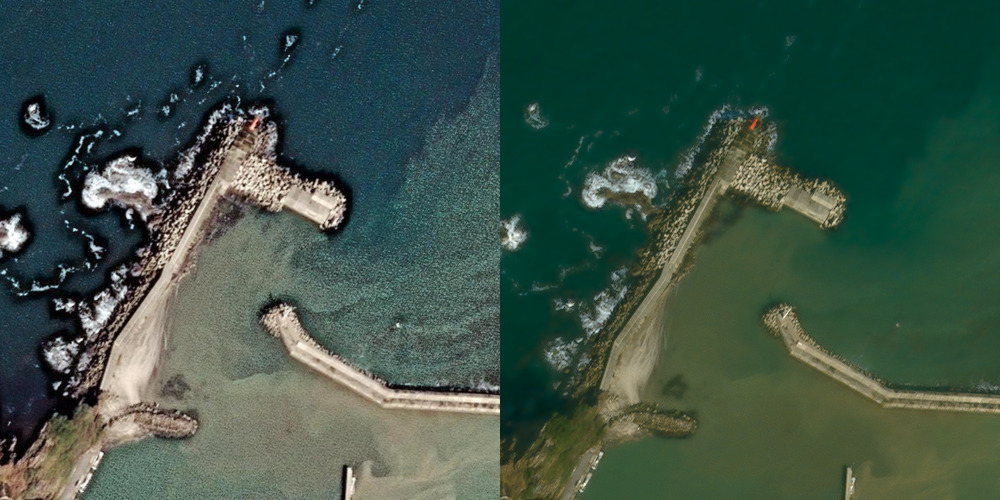
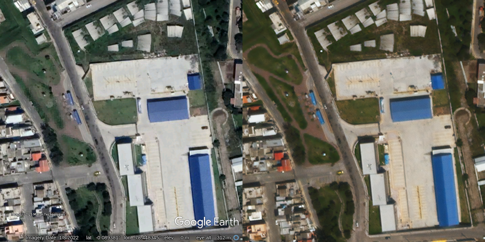
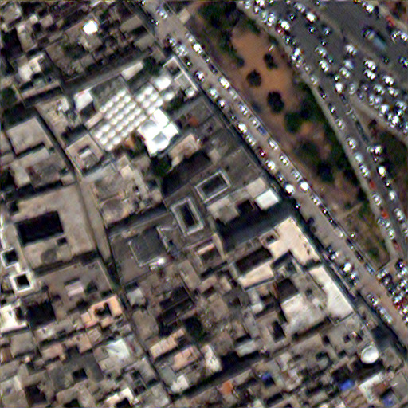
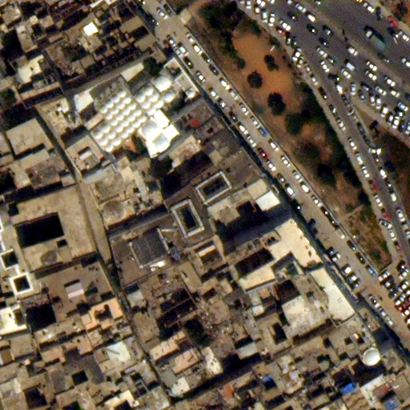
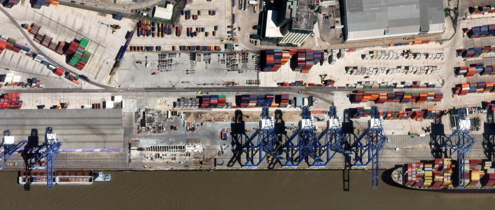
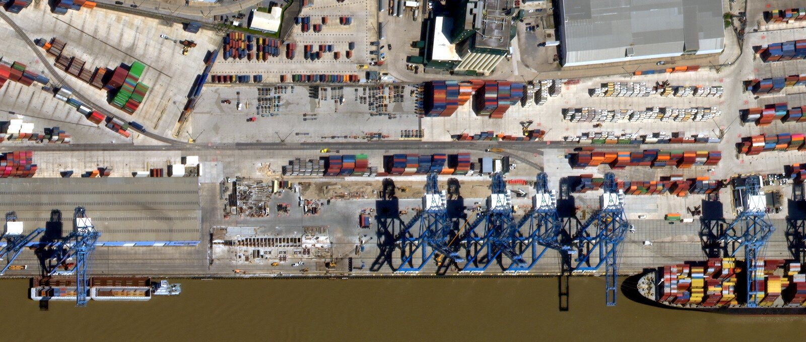
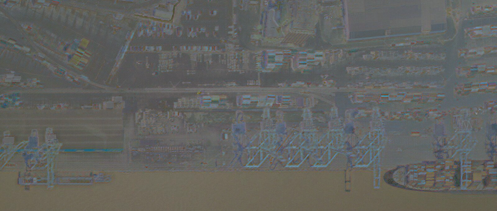
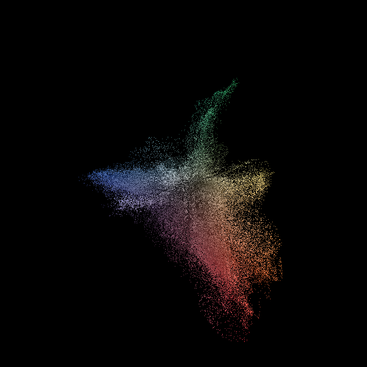
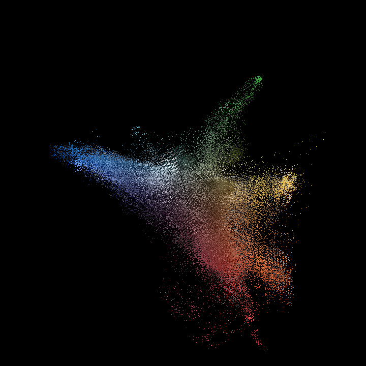
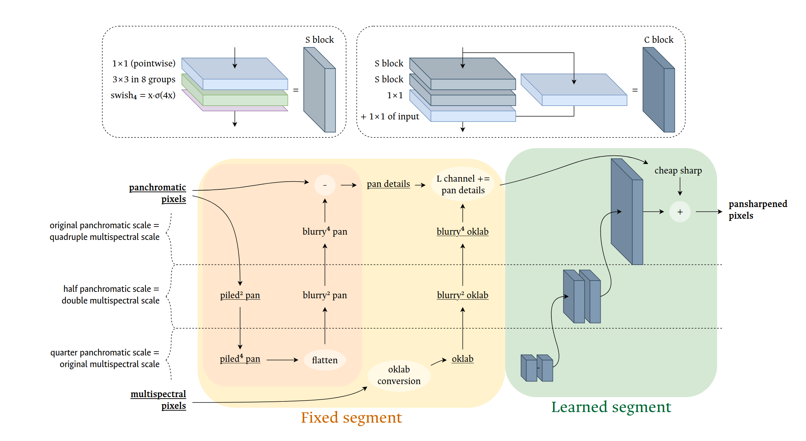

# Potato: a small, data-oriented pansharpener

:potato:



_A crop from Maxar collect 104001006F8B8300 ([CC BY-NC](https://creativecommons.org/licenses/by-nc/4.0/)) as processed by Maxar (left) and Potato (right). The image shows [the cinnabar and white lighthouses](https://kanatah.sub.jp/lh/lh1121.php#0000) on the breakwaters of Takaya, Japan._

## Quickstart

To run the code ASAP, go to the [quickstart guide](docs/quickstart.md). It shows how to install this package, download some free data, and create a georeferenced pansharpened image on your computer in a few steps.

## Introduction

Pansharpening is an image fusion task in satellite image processing, used on most of the satellite imagery on commercial maps. It’s illustrated below.

Potato is a pansharpening research project. It contains a working pansharpener, documentation, and training infrastructure. Potato is free to use and adapt for noncommercial purposes. It’s meant to be useful to people who need to process satellite imagery, but also interesting to others.

The project as a whole makes the argument that pansharpening should focus narrowly on making accurate images for human viewers. <!-- (In fact, that pansharpening as preprocessing for algorithmic pipelines is a conceptual error.) --> This leads to some guiding ideas, including that:

1. Pansharpening is a function from scene-referred data to a display-referred image. Therefore its input should not be normalized, and it should be evaluated in perceptual terms.
2. The correct color output for a set of multispectral band responses is not the R, G, and B bands alone, taken as sRGB channels; it is the color of the light that was measured. To approximate this, Potato uses a fitted matrix that transforms the 5 visible multispectral bands in the source data to an [XYZ color](https://en.wikipedia.org/wiki/CIE_1931_color_space), then the equivalent [oklab color](https://bottosson.github.io/posts/oklab/). Potato is trained on this bands → oklab mapping, and its loss function is a pixelwise oklab ΔE.
3. Real data at full resolution has sensor artifacts that are partly hidden in downsampled training data, so Potato injects synthetic artifacts in order to learn to handle them.

The larger argument is that pansharpening’s design and data issues are more complex than the literature generally represents, but conversely, that up-front attention to these issues can substantially lower the apply-time computational cost of pansharpening at a given quality level. Or, more bluntly, pansharpening is relatively easy if you think about what you’re doing.

Potato is a small convolutional neural network, with fewer than 50k parameters. This is smaller than the smallest of the widely cited deep learning–based pansharpening models, and two orders of magnitude smaller than some research models. One Potato checkpoint file, as uncompressed float32s, is smaller on disk than [the optimized PNG of its own architecture diagram](docs/images/diagrams/potato-architecture.png).

**If this is too technical**, I hope you will find [the deeper documentation](docs) more readable, because it has illustrations and analogies. **If this is not technical enough**, I hope that you _also_ find [the deeper documentation](docs) useful, because it goes into far more detail about assumptions and methods.

## About this readme

This page introduces Potato to a sophisticated layperson – someone comfortable with terms like _pixel_ and _neural network_ but not _Wald’s protocol_ or _hard negative mining_. More specialized readers, or lay readers who enjoy immersion, may prefer [the deeper documentation’s table of contents](docs) (including [the quickstart](docs/quickstart.md), [the conceptual overview](docs/concepts.md) (the opinionated part), and [the command reference](docs/cli.md)).

Contents of this readme:

1. [Introduction](https://github.com/celoyd/potato/#introduction).
2. [About this readme](https://github.com/celoyd/potato/#about-this-readme) (you are here).
3. [About pansharpening](https://github.com/celoyd/potato/#about-pansharpening): a sense of the problem we want to solve.
4. [Comparisons](https://github.com/celoyd/potato/#comparisons): a list of various ways of comparing Potato’s output to other output.
5. [Conceptual approach: why there are no benchmarks here](https://github.com/celoyd/potato/#conceptual-approach-why-there-are-no-benchmarks-here). The mid-length introduction to what Potato is doing differently and why. (The short version is above and the long one is in the [concepts document](docs/concepts.md).)
6. [Technical approach and model architecture](https://github.com/celoyd/potato/#technical-approach-and-model-architecture). Model diagram.
7. [Further documentation](https://github.com/celoyd/potato/#further-documentation). Reminds you once again that the fuller technical documentation is in [docs/](docs/).
8. [Licensing, data credit, and thanks](https://github.com/celoyd/potato/#licensing-data-credit-and-thanks).
9. [Environmental effects](https://github.com/celoyd/potato/#environmental-effects). Some carbon math.
10. [Contributing](https://github.com/celoyd/potato/#contributing).

Suggestions on making this file clearer are welcome (even if I don’t follow them).

## About pansharpening

A typical high-resolution satellite image is collected in two parts. There is a grayscale image at full resolution:


_The sample images here are of Chungthang, Sikkim, from Maxar 10300100CE8D0400, on 2022-03-07. Like most images in this repo, they are [CC BY-NC](https://creativecommons.org/licenses/by-nc/4.0/deed.en) from the [Maxar Open Data Program](https://registry.opendata.aws/maxar-open-data/). See [the license and credits](#licensing-and-data-credit) section._

This is called the panchromatic or pan band, and it works like black and white film, or like applying a grayscale filter to a photo. A band is a range of the spectrum, and pan-chromatic means all-color: the pan band collects basically all visible light.

At almost exactly the same time, the satellite collects a full-color image, with red, green, and blue bands, at lower resolution:


So we have one image that is gray but sharp, and one that is full-color but blurry. We want to merge them into a combination that is full-color and sharp. We can think of this as using the pan image to sharpen the full-color image, so any such process is called **pansharpening**. There are many ways to implement pansharpening, and this project argues that certain ways are better than others.


## Comparisons

### Comparison with Maxar’s pansharpening (Chungthang)

Here we have two examples of pansharpening these panchromatic and multispectral images of Chungthang.

First, the pansharpening provided by Maxar, which operates the satellite that collects the data:


Second, Potato’s output for the same data:


I’ve adjusted the brightness and contrast of both images to roughly match them. Those overall tones are not the focus here: we’re interested in the details. Pansharpened images can be made brighter, more contrasty, or warmer, like any other images; what matters in pansharpening itself is the fine grain of sharpness and color detail.

To see differences, try opening each in its own tab and flipping between them. There is no way to make a perfectly fair comparison, for example because the Maxar image has been lossily compressed and resampled back to nominal resolution. However, several of its shortcomings – dark water edges not present in the inputs, sensitivity to grainy noise, difficulty rendering blue hues – are not plausibly artifacts of those processing steps.

Google Earth [also uses this source image](https://earth.google.com/web/@27.60326593,88.64660971,1610.66494177a,1045.83623347d,35y,0h,0t,0r/data=ChYqEAgBEgoyMDIyLTAzLTA3GAFCAggBQgIIAEoNCP___________wEQAA), and although its color treatment is much darker than Maxar’s, the general look of the pansharpening is similar.

### Comparison with Google Earth’s pansharpening (Quito)

Here is a comparison of a different image chip with a different set of visualization choices. On the left is a small part of Quito as seen on Google Earth ([link to web version](https://earth.google.com/web/search/Quito,+Ecuador/@-0.08986503,-78.44810289,2628.27205598a,346.32203057d,35y,0h,0t,0r/data=Cj4iJgokCSF-pJOHnDtAEQdki5yumDtAGRLQGY0TKlZAIXMmJJ-4KFZAKhAIARIKMjAyMi0wMS0wOBgBQgIIAUICCABKDQj___________8BEAA)) from Maxar 10300100CC8F7900, 2022-01-08; image credit as given within the screenshot. On the right is Potato’s output, resized and linearly color-adjusted to roughly match the screenshot. (Potato renders warmer hues than Google and Maxar tend to. See [the color documentation](docs/concepts.md#all-band-color-conversion) for more detail.)



The rescaling is unflattering to some fine detail in both, but note the blocky artifacting around some of the [brick-through-grass](https://earth.google.com/web/search/Quito,+Ecuador/@-0.08986531,-78.44806574,2632.5715332a,0d,60y,270.41779775h,79.45498836t,0r/data=CiwiJgokCSF-pJOHnDtAEQdki5yumDtAGRLQGY0TKlZAIXMmJJ-4KFZAQgIIASIaChZIX0pETEI2d1VfcndHcS1fQVJTZklBEAJCAggASg0I____________ARAA) textures in the playground/plaza west of the bus stop. This is a relatively rare artifact but a revealing one: it shows a failure state of local adaptation–based pansharpening algorithms, where two multispectral colors compete to statistically latch on the pan band. (The Maxar version of this image also fails in this area, but with blurriness instead of blockiness.) Potato is certainly not perfect, but it paints a picture that reasonably matches on-the-ground views.

### Comparison with ZS-Pan

[ZS-Pan](https://github.com/coder-qicao/ZS-Pan) is a research pansharpener [published in 2024](https://www.sciencedirect.com/science/article/abs/pii/S1566253523003172) that claims competitive results on standard metrics. (The choice of ZS-Pan is because (1) it makes a peer-reviewed claim to high quality and (2) it’s implemented and documented well enough to replicate. I have no other reason to single it out.)

<details><summary>Process for generating ZS-Pan comparison</summary>

Other than the python libraries, this process will use the ImageMagic CLI tools and [uv](https://github.com/astral-sh/uv). For both there are many alternatives (Photoshop, numpy, …; pip, conda, …), and translations should be straightforward.

```bash
cd ~/Documents
git clone https://github.com/coder-qicao/ZS-Pan.git
cd ZS-Pan
uv venv
source .venv/bin/activate
uv pip install torch numpy scipy h5py torchsummary rasterio
```

Download [the WV-3 test data](https://drive.google.com/drive/folders/1x3b3ERBXKGXncTRL3gKcidV5BBdG2QjC) (having followed ZS-Pan’s link to [PanCollection](https://github.com/liangjiandeng/PanCollection).) Assuming it’s in `~/Downloads`:

```sh
mkdir dataset/wv3
ln -s ~/Downloads/test_wv3_OrigScale_multiExm1.h5 dataset/wv3/train.h5

python test.py --satellite wv3/ --name 19
```

The output is in linear radiance and is all-band, so we’ll extract it in a python session; then, still in the session, we’ll set the data up to be used by Potato. We use `rasterio` because it reliably produces multiband TIFFs, while something like `imageio` has a terser API but takes more work to produce correct behavior if the user happens to have certain plugins installed, &c. (This could also work as a script.)


```python
import scipy.io as sio
import rasterio as rio
import numpy as np
import h5py

scale_factor = 3.0

result = sio.loadmat("result/wv3/19.mat")
r, g, b = (result["I_SR"].clip(0, 65535).astype('uint16')[..., b] for b in (4, 2, 1))

with rio.open("19-zs.tiff", "w", driver="gtiff", width=512, height=512, count=3, photometric="RGB", dtype="uint16") as zs_result:
    zs_result.write(np.stack([r, g, b]))

inputs = h5py.File('dataset/wv3/train.h5', 'r')

with rio.open("19-pan.tiff", "w", driver="gtiff", width=512, height=512, count=1, dtype="uint16") as pan:
    pan.write(np.stack((inputs['pan'][19] * scale_factor).clip(0, 10_000).astype('uint16')))

with rio.open("19-mul.tiff", "w", driver="gtiff", width=128, height=128, count=8, dtype="uint16") as mul:
    mul.write(np.stack((inputs['lms'][19] * scale_factor).clip(0, 10_000).astype('uint16')))
```

Note `scale_factor`, which _very_ roughly approximates turning radiance into the 10k reflectance of the ARD format. This shoddy conversion theoretically puts Potato at a disadvantage since the data statistics will be slightly out of its training distribution.

Now we can run Potato (remembering to adjust paths if necessary):

```sh
cd ~/Documents/potato

uv run potato fuse --device cuda ~/Documents/ZS-Pan/19-{pan,mul}.tiff -w 19-potato.tiff
```

Now we have an RGB TIFF from each model, but they are scaled differently; ZS-Pan’s would look virtually all black if opened in an image viewer. (Correct behavior for a radiance→radiance model, or a $\phi_s$ model in the language of the [conceptual documentation](docs/concepts.md), but it’s not what we want here.) We will bring it into a visible range with a channelwise `-normalize`, like an auto-leveling operation in an image editor. We will also give it some modest gamma in order to be directly comparable to Potato’s output (which we will give the same adjustment, other than the gamma). This color mix is not particularly good-looking for either image but it is at least _fair_. Edit paths again as needed.

```sh
magick -channel R,G,B -normalize +channel -gamma 1.25 ~/Documents/ZS-Pan/19-zs.tiff zs-demo.jpeg

magick -channel R,G,B -normalize +channel 19-potato.tiff potato-demo.jpeg
```
</details>

ZS-Pan’s output, following its documentation (adjusted for display with the process above):



_Image source data: Maxar via PanCollection._

And Potato’s, on the same data (also as explained above):



_Image source data: Maxar via PanCollection._

### Comparison with Maxar’s pansharpening (Port NOLA)

Here is another 1:1 of Potato’s output with Maxar’s, this time with some more developed comparison tools. We are looking at the west bank of the Mississippi at river mile 100 – the West Riverside area of the Port of New Orleans (1040010073665D00, 2022-03-24), better known as the [Coffee Gateway to the USA](https://stir-tea-coffee.com/features/coffee-gateway-to-the-usa/). Coffee Drive is in the top of the image, and the Silocaf building is the tall one in the northeast. The images are slightly shrunk for display in this readme; **please click through for full size**. Pansharpening is all about details, and you can’t see them clearly without clicking through.

<details>
<summary>Processing details</summary>

To vary techniques in each comparison, this is in QGIS.

The images are from `s3://dg-opendata/louisiana-tornadoes22/post/15/120202312113/2022-03-24/10400100A0BAD600-*`. The Maxar image (being 8-bit) is presented without stretching, and I’ve adjusted Potato’s parameters to match some sampled grays: min, max for R, G, and B, ×1k, are: 10.5, 45.6; 9.71, 43.7; 9.4, 40.2. Both images’ sampling is 4×4 cubic, and the scale is 1:2500, so they are slightly undersampled (45 cm image pixels displayed at 51.5 cm per screen pixel).

I screenshotted them and cropped. In an effort at some ill-defined notion of fairness – less politely, to show that the problems of the Maxar image are not from JPEG compression alone – the Maxar image is left as a PNG, while the Potato image is compressed to a JPEG of roughly 2.1 bits per pixel, which I measured as a typical compression level for the Maxar JPEG-in-TIFF files (for the full image, excluding the pyramid). The only real loss for the compression is a lovely vivid yellow on the thin crane(?) seen diagonally among the blue cranes on the right; JPEG does tone it down.

The vectorscope below is from [the original Potato screenshot](docs/images/Nola/potato-nola.png) and not its JPEG version because the JPEG conversion showed quantization, while the Maxar version’s (having been resized) is subtler, and I didn’t want to go off on a tangent explaining why.

</details>

Maxar’s rendering, then Potato’s:




I underline once more that because these are roughly curve-matched, they should look very similar until you are seeing them at full size by opening them in new windows.

One way of comparing them is to subtract one from the other and then center the difference at medium gray. In this image, neutral gray means no change, blue means Potato’s output is bluer than Maxar’s, dark gray means Potato is darker than Maxar, and so on:



Potato is better able to represent various bright hues like safety yellow and the hot fuchsia of the [ONE](https://www.one-line.com/en) brand. The shipping containers are a useful stress test because they are only slightly wider than a multispectral pixel. Both pansharpeners here clearly struggle with certain difficult patterns, for example where very saturated colors alternate. But Potato appears to struggle somewhat less overall. It also allows for warmer tones in living vegetation, instead of the bluish greens that the standard method finds.

Many of the largest changes are to colors at the blue end of the spectrum. For example, Maxar renders the outside walls of the building in the lower left (Nashville Ave Wharf B) in periwinkle – a light violet-blue. <!-- `#ab9fd8`, `#73a9fd` --> Potato renders it with a more down-the-middle light sky blue, nearly the color of the cranes standing in front of it. Based on [videos of the port](https://youtu.be/xEJI3SkSH4A?t=229), [Google’s 3D aerial imagery](https://earth.google.com/web/search/New+Orleans/@29.91222285,-90.1157171,11.52396512a,163.67048562d,35y,0.00000001h,60.63998696t,0r/), and other public sources, Potato is closer to reality. Broadly, standard methods tend to avoid clear, medium blues; they often skew them darker or more violet. In short, this is because they do not use the sensor’s deep blue band; in long, see the [deeper documentation](https://github.com/celoyd/potato/blob/docs/docs/features.md#all-band-color-conversion).

<!-- <details>
	<summary>Vectorscope visualization</summary> -->

We can also explore these color characteristics with a _vectorscope_, a visualization used in film grading to see pixels projected onto the chroma plane of a luma/chroma colorspace. Here is a vectorscope visualization of Maxar’s image:



And Potato’s:



<!-- There is much to interpret here but also some pitfalls. For example, raw saturation (pure distance from image center) isn’t very important here; as mentioned in the first comparison, that kind of thing would be trivial to correct and doesn’t get to the actually difficult parts of this process. Also, the very light lime and seafoam lines in Potato will be from the clipping inherent in QGIS’s linear stretch – see the processing details above. It is more telling that -->

Potato’s output shows more middle blues in an image that should contain middle blues (for example, the [sky-blue cranes](https://portnola.com/info/news-media/press-releases/seacor-marine-receives-marad-grant-also-initiates-carbon-offset-program) and some of the shipping containers) while Maxar’s blue arm skews counterclockwise and inward, toward gray-purples. We can also see the cluster of mistaken periwinkle. Likewise, Potato uses a variety of greens, from cyans to near-yellows, while Maxar renders both Evergreen shipping containers and actual grass with a surprisingly similar hue angle. The ONE brand color is also clear in Potato’s output.

In general, Potato’s vectorscopes show a more filled-in use of the gamut. This is because standard pansharpening is working in a color space with 3 primaries (blue, green, and red bands), but Potato uses 5 primaries (deep blue, blue, green, yellow, and red), which gives it a larger addressable space. This is discussed further in the [deeper documentation](docs/features.md#all-band-color-conversion).

<!-- </details> -->

## Conceptual approach: Why there are no benchmarks here

If you read papers on pansharpening or related topics, you are likely suspicious that you are so far down the page without having seen a table that compares Potato to its peers in terms of metrics like PSNR and spectral angle. This is because Potato is not trained on the same kinds of inputs and outputs as most pansharpeners are. There is no direct comparison in the same way that you can’t usefully rank a pair of running shoes within a list of work boots. Runners judged as boots are terrible, and vice versa, and no useful information is revealed.

Potato’s argument, in this analogy, is that a large fraction of existing pansharpening research and practice is trying to run in work boots. Potato aims to be useful as a pansharpener, but in the bigger picture its goal is to demonstrate a fresh way of thinking about pansharpening as a problem and to inspire research in that direction.

Specifically, Potato contends that pansharpening’s only audience is human perception, and therefore any accurate metric must be based distance in a perceptually uniform color space. Most pansharpeners that make their intentions formal are functions from pixels in units of radiance or reflectance to the same unit, which are not perceptually uniform. Potato’s argument – in [the conceptual documentation](docs/concepts.md) – is that the correct function signature for pansharpening is from radiance or reflectance to a perceptually uniform color space. Or at least a practical approximation of one: Potato specifically is from reflectance to [oklab](https://bottosson.github.io/posts/oklab/).

Given common input types, it’s possible to _show_ Potato’s outputs against other models’ outputs for the same input – see above. But the only correct comparison _metric_ in my opinion is perceptual distance (ΔE) or a textural metric based on it, which would be assuming the conclusion. Other pansharpeners aren’t trained on ΔE and (at least implicitly) their designers did not believe it’s the right evaluation function, so it’s not fair to them to take it as the figure of merit. In fact there are further layers to this, for example:

- Potato uses an 8:3 multispectral band:channel conversion (where most do 3:3 or 8:8), so we can’t even compare input RGB to output RGB, because they’re different RGBs. Doing 8:3 conversion on standard methods would again be evaluating them on a metric they aren’t trained for.
- Conversely, Potato attains spectacular PSNR scores (~56) when judged on its sRGB output against its sRGB input simply because its output is relatively low-contrast when converted to sRGB directly out of oklab. This is basically meaningless.
- Potato also emphasizes that the actual goal is full-size pansharpening, and full-size data includes artifacts that we cannot exactly reproduce at downsampled scales. Potato tries to account for these and others do not.

This problem of fair comparison has troubled me as much as any technical issue in the project. In fact it has shaped the whole delivery: it’s why Potato is a heavily documented software package instead of an arxiv paper with a little companion repo. I’ve cornered myself in a position where I want to present results _and_ to say that standard evaluation metrics are wrong. It’s awkward. It makes people I chat with at open data cocktail parties wince when I say it. It means that in some places, Potato is code with commentary explaining why it’s done that way, but in other places, maybe most places, it’s an argument about pansharpening that’s illustrated by code.


## Technical approach and model architecture

Potato’s approach is based on attaching convolutional blocks to a standard non-adaptive pansharpening method. (Specifically, where a high-pass of the pan band is added to the upsampled multispectral image. This is a member of the “detail injection” family.) The point of this simplicity is to show that an elaborate or large network is not necessary to acceptable output, and that the interesting parts of Potato are all in how it trains, and particularly how it handles its training data.

This model diagram is trying to do the opposite of the model diagram in a typical pansharpening paper. It hopes to convince you that it is _not in any way_ clever, innovative, or worth thinking about.



For completeness, not because it’s interesting: In the west third of the architecture (pale orange), we extract high-pass detail from the panchromatic band. In the middle third (pale yellow), we construct an upsampled oklab image and add the high-passed pan details to its L channel. Together these implement a standard, low-complexity, non-learned pansharpening method, the output of which we call the _cheap sharp_. The east third (pale green) is the convolutional blocks, which have access to the intermediate values of the fixed process and, at the end, provide a delta to refine its final output.

The C block is a vanilla convolutional image processing block. The swish₄ function is a form of smoothed ReLU. Data is implicitly piled (space-to-depth transformed) where southward arrows cross the dotted lines indicating scales, and bilinearly upsampled where crossing northward. Underlined elements are concatenated into inputs for the blocks at their scales. (In the first draft of the diagram, there was an explicit arrow from each now-underlined item eastward to the input of the corresponding block, but this made for many confusingly crossing lines.)

For example, the inputs to the mid-scale convolutional blocks are:

1. the once-piled pan, 
2. the once-upsampled oklab, and 
3. the once-upsampled output of the small blocks.

Potato can be understood as a U-net with its L half implemented as non-trainable operations. That half proposes a draft output, which the trainable J half adjusts in predictor–corrector style.


## Further documentation

Please see [the docs directory](/docs) for a quickstart guide and lengthy discussion of the unusual techniques in Potato.

## Licensing, data credit, and thanks

### Licensing and data credit

Potato’s original work, including all its code, is distributed under the [Creative Commons Attribution–Noncommercial license](https://creativecommons.org/licenses/by-nc/4.0/deed.en).

> [!IMPORTANT]
> All satellite imagery in this repository, except as otherwise credited, is derived from data copyright © Vantor, a.k.a. Maxar Technologies, under the [Creative Commons Attribution–Noncommercial license](https://creativecommons.org/licenses/by-nc/4.0/deed.en), via [the Maxar Open Data Program](https://registry.opendata.aws/maxar-open-data/) (see further information there), adapted and modified as described in the accompanying text. Please alert me to any errors or oversights in citation.

I am a keen supporter of the Maxar Open Data Program. It is an example of lifesaving philanthropy that I hope other satellite companies will follow. I hope to further its aims by introducing it to more people. The highest success for Potato would be to contribute in any way to the more widespread and effective use of satellite imagery for humanitarian ends.

Maxar changed its name to Vantor after most of this documentation was written. However, the Maxar Open Data program still uses that name, Google Earth still credits its data as Maxar, etc., so I will save the name change for a future update. (In fairness, I still sometimes slip up and refer to Airbus’s imagery operation as Astrium, which it hasn’t been since 2013.)

### Thanks

Many people have taught me key skills, pointed me down useful paths, or at least listened politely to my aimless diatribes on this topic over the years. Some are Camilla Mahon, Bhavika Tekwani, Damon Burgett, Justin Pickard, Kevin Bullock, Kevin Wurster, Rahawa Haile, Robert Simmon, Virginia Ng, and Yoni Nachmany. Marc Pfister does the tireless work of distributing the data Potato is trained on. This documentation benefited from notes from Mike Migurski and Max Fenton.

Stephan Hügel (@urschrei) started me talking publicly about pansharpening – not just glaring at Jupyter notebooks – by eliciting a [pansharpening Long Telegram](https://gist.github.com/celoyd/5bb5417b24801e0446ad5977cc3581e4) in 2021. Potato is a development of that e-mail. And since then he has often had a thought-provoking question or a kind word at just the right time.

Peter Richardson (@meetar) took an interest in Potato when it was some borderline unrunnable code and sketchy, conflicting ideas for a wavelet-based pansharpener called Ripple. He was pulled away after a few sessions of analysis and brainstorming, but his contributions were crucial. For example, when I told him some ideas for the bands-to-XYZ matrix, he firmly advised the straightforward optimization option. It’s plain in retrospect that he was exactly right. That guidance alone probably saved 20 hours of dispiriting tinkering with something baroque. Without his help, Potato might have deliquesced back into one-offs and what-ifs.

Potato shares little with the approach in [_Pansharpening by Convolutional Neural Networks in the Full Resolution Framework_](https://openremotesensing.net/wp-content/uploads/2022/07/Pansharpening_by_Convolutional_Neural_Networks_in_the_Full_Resolution_Framework.pdf), by Matteo Ciotola and others, yet that paper has shaped my thinking ever since I read and re-read it on a holiday weekend in 2022 instead of playing Wingspan with my friends. It shook loose many of my ideas about pansharpening and demonstrated the creativity enabled by a principled approach.

Although I am grateful for all help and inspiration, blame for Potato’s problems is only on me.


## Environmental effects

I’ll assume, based on my GPU’s power rating and benchmarked generation rate, that Potato runs at 150 J/s and 12.5 megapixel/s, or 12 J/Mpel. (It uses 3.5 to 4× as much energy per work if run entirely on the CPU; only the GPU is considered here. Current-generation GPUs are roughly twice as efficient, and can also run at half precision, so may approach 3 J/Mpel.)

CAISO, the local grid authority, does not publish marginal GHG intensity, so I’m working from estimates like [figure 2 in Mayes et al. 2024](https://www.researchgate.net/figure/Month-hourly-average-left-and-marginal-right-Emissions-Factors-for-the-CAISO-grid-in_fig2_374597170) (from 2021, when the grid emitted ~30% more). My GPU use is very sensitive to the temperature of my living space, which (given California’s cooling-heavy duck curve) shifts it to grid-friendly times: the GPU is nearly always idle at peak, and in winter, it’s substituting residential heating. My best point estimate of my marginal intensity is 160 g/[kWh](https://www.youtube.com/watch?v=kkfIXUjkYqE).

A CO₂e intensity of 160 g/kWh at 150 W = 6.7 mg/s = 24 g/hour = 575 g/day = 18 kg/month = 210 kg/year. This is the estimated CO₂e production of _continuous_ Potato use on my hardware. From the processing rate, we also get a CO₂e/pixel estimate: 536 µg/Mpel = **536 grams per terapixel**.

The training data has a mean ground sample distance of about 50 cm per pixel: a density of 4 Mpel/km². This gives us the CO₂e per area processed of **2.15 mg/km²**. We can now estimate, for example, the carbon emissions of pansharpening Earth’s whole land surface at that GSD with Potato: 320 kg (over a year and a half, if on my agèd GPU).

My estimate for Potato’s total training time is 5 GPU days. (When I first wrote this paragraph, it was more like 3.5, but my estimate has turned out about right, I think.) Training draws about the same power as inference, since both nearly saturate the GPU. So the GPU-originated emissions embodied in Potato’s trained weights are about **3 kg CO₂e**.

<details>
<summary>Remarks</summary>

A few comparisons for context:

- My personal carbon emissions rise, on average, 2% over whatever they would otherwise be while I’m using Potato.
- At this level, Potato in continuous use emits about 2/3 as much CO₂ as I do by exhalation.
- Our compact car emits on the order of 100 g CO₂e/km, similar to a widebody commercial flight (pax⁻¹). All my Potato work is thus similar to inducing a single 30 km car trip, or, spread over a year, 82 extra meters of driving per day, or, at urban arterial speeds, 5.2 seconds of extra driving per day. (Or 2 minutes of extra widebody flying per year.)
- Potato’s total emissions to date are roughly equivalent to that embodied in 30 g (1 oz) of conventionally farmed steak, one large hand of bananas, or 150 g (6 oz) of chocolate. Or 10 kg (22 lb) of potatoes – a carbon-friendly food, and much more nutritious than most assume.
- The dominant factor in Potato’s direct greenhouse forcing effects to date, as far as I can account for them, has been food and drink choices I have made while working on it.

The assumption that deep learning is necessarily wildly energy-hungry only serves to benefit the outliers who do it in wildly energy-hungry ways. I will give them no cover. Our moment deserves a sprawling, heterogeneous, complex ecosystem of individuals and small groups tinkering with these technologies, charting possibility spaces and developing bottom-up understandings, independent of any business goals, and with hobby-scale carbon emissions. I see only shadows and echos of that.

For example, from what I’ve heard, there is much to admire in what the [RWKV](https://www.rwkv.com/) people are doing: producing capable models with computing resources that [large companies give away for free](https://www.youtube.com/watch?v=LPe6iC73lrc#t=24m18s), making the creation of accessible tools an explicit ideal, and without externally determined goals. Perhaps if I looked closer I’d notice them doing things I disagree with – but all the more reason I should be able to name a dozen peer groups to RWKV, each with its own choices, ethos, and technical interests. I can’t. And I think that’s a serious problem.

We all live in a blighted landscape ML-wise: an ecosystem without a middle. We have kaiju-like companies that shake the ground with every step. We have millions of consumerified “AI” users, the economic equivalents of algal mats, almost all without any practical options other than choosing which models to pay for and how to prompt them. What we don’t have in plenty are, in the ecosystem metaphor, the ordinary iguanas, caribou, and wallabies; the salamanders, honeybees, and potatoes. These are the RWKV peers, the people making their own pansharpeners and birdsong decoders. They are rare and even more rarely organized.

The kaiju, battling each other off in the haze, project the impression that there is no point doing anything unless you’re big enough to level forests while you do it: that it would be irrational to even _try_ to compete with them, because you can’t burn enough carbon to play their game. Credulous “AI skeptics” transcribe these roars and psionic blasts with concern, as if they are good-faith veridical statements that we should accept uncritically. After all, the kaiju are the experts! If _even they_ say you have to spend a petajoule and act like a kaiju to do anything interesting, why should we doubt them? And so the algae-and-kaiju world maintains itself.

No. There are thousands of niches available in individual- to chat-server–scale ML work that uses data and energy conscientiously and tries to understand this odd technology on terms other than those chosen by the kaiju and accepted by their pseudo-critics. Come be an octopus, a mangrove, or an okapi.

I’m not telling you to make a state-of-the-art LLM on your home computer. I’m telling you that the world of ML is bigger, more interesting, and _better_ than O(<var>n</var>²) chatbots with 10,000,000,000 parameters.

Do the carbon math. Make ethically cautious but socially adventurous choices. Try something.

</details>

## Contributing

Potato is basically a personal project, intended as a one-and-done demonstration, not as a continually improving pansharpening package. It’s born in bug-fix–only mode. Feel free to file an [issue](https://github.com/celoyd/potato/issues) to point out an error, propose a fix, or ask a question, but ideas for bold new features are unlikely to interest me here; mine are going in other (as yet unreleased) projects. I warmly encourage new work that builds on Potato in license-respecting ways. The whole point of this project is to get more people doing better work on pansharpening, and if Potato is a useful foundation or even a productive annoyance to you, I’m happy.

----

This work is licensed under a [Creative Commons Attribution-NonCommercial 4.0 International License](https://creativecommons.org/licenses/by-nc/4.0/).
