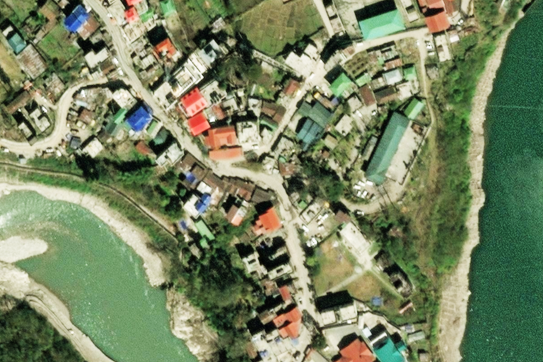
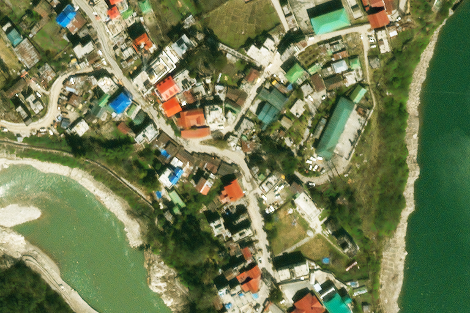

# Potato: a pansharpening model

:potato:

## About Potato

Potato is a research pansharpening model with a training setup and documentation. Its goals are to:

1. Raise interest in pansharpening.
2. Raise expectations of the quality per complexity of pansharpening methods.
3. Introduce some transferable techniques to improve pansharpening.

The model is a convolutional neural network that is small (~50k parameters) and of simple design. Potato’s training data is from the Maxar Open Data Program, and like that imagery, it is licensed CC BY-NC. It can be applied (noncommercially) in its present form – see [the quickstart](docs/quickstart.md) – but it is not tested, reviewed, or optimized for general-purpose use; it’s a research project. It aims to be a good influence on the next generation of applied pansharpening models, not to lead them.

## About pansharpening

_This explanation will skip many details, even some that specifically motivate this project. The only goal is to show the core idea of pansharpening to people seeing it for the first time._

A very high resolution optical satellite collects an image in two parts. It gets a grayscale image at full resolution:

_The samples images here are of Chungthang, Sikkim, from Maxar collect 10300100CE8D0400 on 2022-03-07. Like all images shown in this repo except otherwise credited, they are [CC BY-NC](https://creativecommons.org/licenses/by-nc/4.0/deed.en) from the [Maxar Open Data Program](https://registry.opendata.aws/maxar-open-data/)._

This is called the panchromatic or pan band, and it works like black and white film, or like applying a black and white filter to a photo. A band is a range of the spectrum, and pan-chromatic means all-color – this band collects the range of all visible light.

At the same time, the satellite collects a full-color image, with red, green, and blue bands, at lower resolution:

So we have one image that is sharp, and one that is full-color. We want to merge them into a combined version that is both sharp _and_ full-color at the same time. We can think of this as using the pan image to sharpen the full-color image, so the process is called **pansharpening**.

Like compression or instant messaging, pansharpening isn’t any one algorithm or technique; it’s a category defined only by the problem being solved.

## Example

Two examples of pansharpening these pan and multispectral images of Chungthang.

Frist, this is Maxar’s pansharpening that they provide with the data:

I’ve made small adjustments to match it to the general brightness and contrast of Potato’s output for the same data:

To see differences, try opening each in its own tab and flipping between them. There is no way to make a completely fair comparison, for example because the Maxar image has been lossily compressed and resampled back to nominal resolution. However, several of what I consider its shortcomings – the dark water edges, sensitivity to grainy noise, difficulty rendering deeper blue hues – are not plausibly artifacts of those processing steps. Google Earth [also uses this collect](https://earth.google.com/web/@27.60326593,88.64660971,1610.66494177a,1045.83623347d,35y,0h,0t,0r/data=ChYqEAgBEgoyMDIyLTAzLTA3GAFCAggBQgIIAEoNCP___________wEQAA), and although their color treatment is much darker than Maxar’s, the general look of the pansharpening is similar enough that adding it to the comparison would be practically redundant.

## Documentation

Please see [the docs directory](/docs) for a quickstart guide and lengthy discussion of the unusual techniques in Potato.

## License

Potato is licensed [CC BY-NC](https://creativecommons.org/licenses/by-nc/4.0/deed.en).

## Contributing

Potato is basically a personal project, and is intended primarily as a one-and-done demonstration, not as a continually improving pansharpening package. It’s born in bug-fix–only mode. Feel free to file an issue to point out an error or ask a question, but ideas for bold new features are unlikely to interest me here; mine are going in other (as yet unreleased) projects. I warmly encourage forks that build on Potato in license-respecting ways. The whole point of this project is to get more people doing better work on pansharpening, and if Potato is a useful foundation or even a productive annoyance to you, I’m happy.
