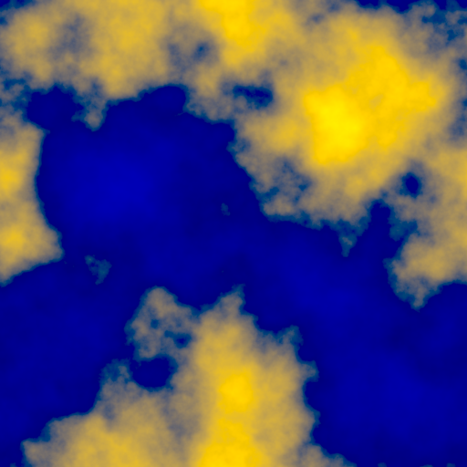
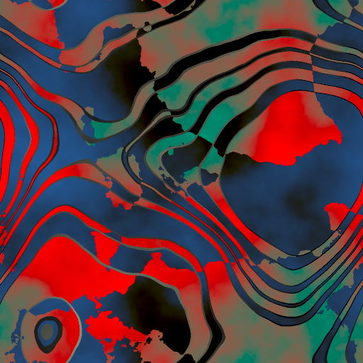
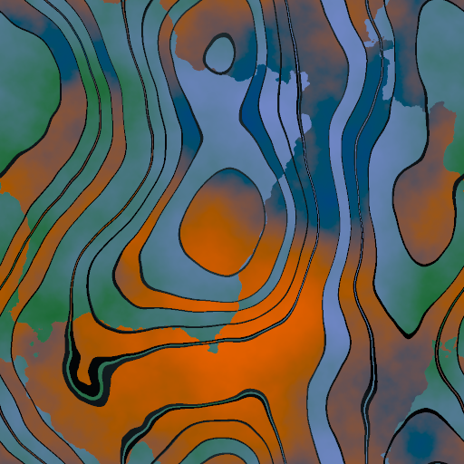
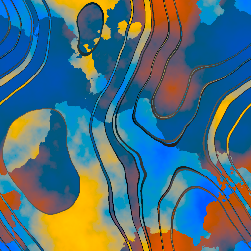

# `potato` CLI tool guide

This page is the general reference for the `potato` command-line tool. To simply pansharpen something as soon as possible, see [the quickstart](quickstart.md). For brief guidelines, see the tool’s built-in documentation (`potato --help` or `potato \<command\> --help`). For the actual code, see the actual code.

`potato fuse` is the command that actually does pansharpening of big images. Everything else is for visualizing results and/or training the model.

The general workflow for training Potato is:

1. Download ARD data. (Use `aws s3 sync s3://maxar-opendata/events/... .`, the [STAC browser](https://radiantearth.github.io/stac-browser/#/external/maxar-opendata.s3.dualstack.us-west-2.amazonaws.com/events/catalog.json?.language=en), ARD data you own, etc.)
  - Optionally, select CIDs you want to use ([docs on that](../ancillary-data/cids/)), or go with the default CID list in `ancillary-data/cids/allow-list.csv`.
2. Use `make-chips` to make chips.
  - Optionally, use `get-reflectance` and/or the default reflectance list in `ancillary-data/fake-chips/reflectances.csv` to assemble some reflectances and run `fake-chips` to collect some synthetic training data.
3. Use `link-chips` to collect all the chips you want to use into training and testing pools.
4. Use `train` to train Potato.
5. Use `check` (and the other visualization tools) to have a look at how it’s doing.

## Installation

_These instructions duplicate the ones in [the quickstart](quickstart.md)_.

Here you will install a virtual environment with Potato the library, its dependencies, and `potato` the command-line tool.

These instructions use the [uv](https://docs.astral.sh/uv/) management tool, which I warmly recommend. However, all that’s important is that you end up in a virtual environment with the dependencies named in `pyproject.toml`.

With `uv`, do this in the top directory of this repo:

```bash
uv venv
uv pip install -e .
source .venv/bin/activate
```

The standard venv installation depends on how your system python, if any, is set up (_this is a problem `uv` can avoid!_), but something like this is likely to work – possibly replacing `python3` with `python` for example:

```bash
python3 -m venv .venv --prompt potato
source .venv/bin/activate
pip install -e .
```

This will download and install many packages.

Unless you’re in the kind of hurry where you can’t spare 5 seconds, run the tests. If you’re in the virtual environment:

```bash
pytest
```

Or, if you have `uv` and prefer not to stay in the virtual environment:

```bash
uv run pytest
```

If there are failures, make a reasonable effort to work out why, and if it’s not your fault, file a bug.


## General notes and conventions

<!-- This guide follows [RFC 2119](https://datatracker.ietf.org/doc/html/rfc2119) (the must/should one) but in lowercase. -->

Some CLI arguments have long and short forms (`-w`/`--weights`), and I may occasionally slip up and document only one but show the other in an example. Refer to `potato <command> --help` or the code.

All input data is assumed to be in the Maxar ARD format. Other data can work if it’s similar, but it may require knocking out some sanity checks in the code, and it is unlikely to get very good results. For example, since ARD is atmospherically corrected, images in TOA radiance – even scaled to keep the peak values near 10,000 – will likely be hazier than anything Potato saw in training (at least _my_ training). Please try it, but start with low expectations.

Where any combination of panchromatic, multispectral, and pansharpened images are referred to together, it’s always in that order. (This applies to the code as well as the documentation.)

Code is aggressively linted, but not type-hinted. Code coverage is fairly low overall, mostly because it would be painfully difficult to properly mock resources for things like `make-tiles`, but the core functions (like the model itself and the color conversions) are reasonably well-tested.

## Core functions

These are the fundamental parts of Potato: actually pansharpening, training the pansharpening network, and making data for training.

### `potato fuse`

This is the pansharpening function. Basic example:

```bash
potato fuse 10400100B06C8A00-pan.tif 10400100B06C8A00-pan.tif colombo.tiff
```

There are three required arguments, in order: a **panchromatic input**, a **multispectral input**, and **an output** file. The inputs should fit the ARD spec. (You can certainly try sending other data through, maybe manually knocking out some of the checks in the code, but keep your expectations low.) For brevity, I often use a shell expansion like so:

```bash
potato fuse 10400100B06C8A00-{pan,ms}.tif colombo.tiff
```

The files can be anywhere that the `rasterio` library (based on GDAL) can get to from a path-like string. For example, you can read off HTTP:

```bash
potato fuse https://maxar-opendata.s3.dualstack.us-west-2.amazonaws.com/events/WildFires-LosAngeles-Jan-2025/ard/11/031311103120/2025-01-08/10400100A24E1900-{pan,ms}.tif fire.tiff
```

You could read the pan file from one cloud service, the mul file from another, and write the result to a third. The possibilities are limited only by the GDAL driver ecosystem and your patience for setting environment variables and bucket permissions.

`potato fuse` will by default read a model checkpoint (a.k.a. weights) from `sessions/latest.pt`, which `potato train` leaves there. You can also specify a model checkpoint with **`--weights`**.

**`--block-side`** sets the edge length of the squares that are pansharpened. More strictly, it sets that size for squares _as written_; they’re actually pansharpened with a margin (see `--apron` in a moment). This is the main control over how much GPU RAM is used, but that’s also related to `--apron` and `--workers`. The default of 1024 should work tolerably on most GPUs, but if 16384 will fit, try it.

**`--apron`** is the extra margin to pansharpen around each image block. It’s stripped off before the block is written to the output. This is to remove edge effects. Potato’s receptive field is a square 56 pixels on a side, so 28 would be the guaranteed safe apron. In practice, 16 or even 8 would probably suffice. The default is 20.

The model will run on the torch device specified by **`--device`**, defaulting to `cuda`.

The model runs on only a single image chunk at a time, instead of in batches. The model is fed by a default of 4 i/o workers, set with the **`--workers`** flag. (On my late-career desktop, `--workers 2` is actually nearly enough to saturate the GPU, but naturally this will depend on your hardware.) There’s a multi-way tradeoff here involving code clarity, raw speed of inference, disk i/o overheads, device i/o versus throughput balance, etc., and most choices in `fuse` are for simplicity.

**`--overwrite`** allows clobbering the output file.

### `potato train`

This trains the model. It depends on data discussed below in `make-chips`.

On the topic of training, even more than in other parts of this project, users’ tastes and resources will vary widely. One person may be using an old laptop but likes obscure optimizers, regularizers, and schedules; another might have vanilla tastes but is deploying it on their university’s cloud account. So `potato train` is an example of how one may train Potato, not how one must or should.

A reasonable minimum `train` command looks like this:

```bash
potato train --session demo --chips chips/a --test-chips chips/b --train-length 1024 --pbs 8 --lbs 32 --epochs 32
```

The trainer logs with the `aim` library. Run `aim up` in the root folder for its UI. A known problem (#82) is that logs do not respect sessions; they’re split by physical runs.

**`--session`** names a training session for logging and tracking checkpoints. If it does not exist, a folder by that name will be created within the folder specified by **`--checkpoints`**, or by default `./sessions/`. If it does exist, its checkpoints will be loaded, unless: if **`--start-from`** is defined, it will cause the loading of some other epoch’s, and potentially some other session’s, checkpoint. The syntax is `session[/epoch]`, like `example/123` or just `example`. This for allows branching sessions in order to fine-tune. Checkpoints are always named `<n>-gen.pt` (the model or generator checkpoints) and `<n>-opt.pt` (the optimizer checkpoints).

**`--weight-link`** (default: `sessions/latest.pt`) specifies a path where the trainer will keep a link to the latest weights. This allows `fuse` and `check` to have a fixed default weights path.

**`--chips`** specifies a source directory of training chips. Chips are training pairs (discussed further in `make-chips`). These must be named 0.pt, 1.pt, etc., to work. (`link-chips`, below, makes this easy.) **`--test-chips`** is similar but for testing.

**`--train-length`** (default: 4096) is the number of chips to train on per epoch. **`--test-length`** (default: 256) is the number of chips to test on per epoch.

**--epochs** is the number of epochs to train for, or specify the conflicting **`--up-to-epoch`** to give an epoch to stop just before. There is an epoch 0 (unwise in retrospect, but we live life facing forwards), so if you start a new session and specify `--up-to-epoch 100`, you will get 100 epochs, the last being 99.

**`--learning-rate`** or **`--lr`** is the learning rate for the AdamW optimizer. The default is 5e-4.

**--logical-batch-size** or **`--lbs`** is the batch size as experienced by the optimizer. This is what most people most of the time mean by batch size.

**--physical-batch-size** or **`pbs`** is the actual number of samples run on the device at a given time. This is a memory optimization only: we can have any conceivable logical batch size, but to actually run it, we break it into a physical batch size that can fit on the device. This does not affect output results; `--lbs x --pbs a` will give _exactly the same results_ (up to PRNG state etc.) as `--lbs x --pbs b` for any _a_ and _b_ that don’t error. A larger physical batch size should in general run faster, by proportionally reducing overheads, up to the point where it OOMs and ends the session. During training I’ve generally used a PBS that takes up about 3/4 to 7/8 my GPU’s RAM. If you know training is the only thing using your GPU, it might as well be nearly 1/1. Given the complexity of device memory models and various other considerations, I firmly recommend figuring out your optimal PBS experimentally instead of trusting that your priori reasoning will match what your system actually does. 

**`--logical-batch-size`** meanwhile is the thing that actually affects training: how many samples’ gradients are aggregated into a vector for the optimizer. The default is 64; that’s probably a little high for most purposes.

**`--workers`** (default: 4) is the number of chip-loaders. These do some computational work (some augmentations are within the loaders!), so even with an arbitrarily fast disk it’s useful to have more than one.

**`--device`** is the torch device to use: `mps`, `cuda`, `cuda:0`, etc.

**`--verbose`** prints an overview of the training plan before starting. I have never once _not_ used this since adding the feature, so it defaults to `true`.

### `potato make-chips`

(This documentation section is surprisingly long because it’s where we document several technical topics other than a user’s perspective on `potato make-chips`. But if you are advanced enough to want to make chips, these are things you should know.)

A chip, in image processing and remote sensing jargon, is a small image, especially a subset of a large image. I picked this name before the name Potato, for what it’s worth.

The training data for Potato is a pair of panchromatic and multispectral data (as input) and the oklab image that the hypothetical perfect pansharpener would construct from them (as output). We produce this basically by “Wald’s protocol” (misnamed – Lucien Wald is one of the few legitimate authorities on pansharpening, but he disclaimed credit for this technique). That is:

- Given panchromatic data P at some resolution 0 (let’s say 50 cm) and multispectral data M at resolution 1 (let’s say 2 m), we take the appearance of the multispectral data as the target, _y_.
- We take _r_ as the linear ratio between the resolution of the panchromatic and multispectral bands. For the data contemplated by Potato, that’s 4. We downsample both the P and M data by _r_, yielding panchromatic data at resolution 1 (the original multispectral resolution, 2 m) and multispectral data at resolution 2 (here, 8 m). We call their combination _x_.
- The training sample is the pair of (P₁, M₂) as the input (_x_) and M₁ as the target (_y_).
- Training on this (P₁, M₂) → M₁₁ mapping, we hope, trains the pansharpener to be actually applied at full resolution as a (P₀, M₁) → M₀ mapping, where M₀ is multispectral data at the resolution of the panchromatic data.

Potato’s only modification to this traditional process is to add an extra downsampling, so that our chips are actually (P₂, M₃) -> M₃. This has the disadvantage of moving further from the real data distribution in terms of spatial scale, but the advantage of suppressing sensor artifacts. See the [conceptual documentation](concepts.md) for more.

Potato defines the chip size as 512×512 for P₁/M₁ and 128×128 for M₂. Given that the receptive field of Potato is only about 28×28, this is larger than it strictly needs to be. It has, however, sufficed. (A cynic might claim that when I say “Potato defines…” I mean that I hard-coded it and don’t want to do the work of parameterizing it. Ridiculous.)

Maxar’s analysis-ready-data format, or ARD, is a remarkably well-designed way of delivering multiple raw satellite images as a kind of meta-bundle. It essentially represents some given area (polygon on Earth) as recorded in some set of satellite observations (catalog identities, or CIDs), each given as a pair of panchromatic and multispectral TIFFs in roughly 5 km × 5 km tiles, in units of reflectance, i.e., atmospherically corrected.

The job of `make-chips` is to walk over an ARD (in principle, a set of ARDs, but the CLI is only set up for one ARD at a time), collect all the ~5 km × ~5 km image tiles, read from them in a [low-discrepancy sequence](https://en.wikipedia.org/wiki/Low-discrepancy_sequence), resample that data, construct chips, and write them.

The low-discrepancy sequence is Martin Roberts’s [R₂](https://extremelearning.com.au/unreasonable-effectiveness-of-quasirandom-sequences/), an extension of &phi; sampling to 2D. This is, in a sense that is tedious to formalize, a pattern that is optimally spread out over any possible number of samples. In other words, if we select a very small number of samples from it, they are widely spaced; but if we _continue that process_ to select a large number of samples including the first ones, they are _also_ well spread out given the number of samples compared to the sample space. This is somewhat better than random sampling in the sense that it “actively” avoids sampling the same place twice.

My process in general is to pull from my local mirror of the Maxar Open Data Program dataset (on my NAS, `/mnt/seastar`) like this:

```bash
potato make-chips --allow-cids tools/allow-list/allow-list.csv --ard-dir /mnt/seastar/pansharpening/maxar-opendata/Earthquake-Myanmar-March-2025/ard  --chip-dir /media/ch/wobbegong/gen9/my25/ --log /media/ch/wobbegong/gen9/my25/generation.log -n 2048 
```

**`--allow-cids`** names a file with one CID (catalog identifier) per line. Only those CIDs will be used. If not given, all CIDs will be tried, which is probably not wise. Potato ships with my personal list in `ancillary-data/cids/allow-list.csv` and some documentation about the selection process in that directory.

**`--ard-dir`** is the folder to use as input. (I think of “directory” as Microsoft-speak and “folder” as how people actually talk, but I suppose Unix used “directory” first.)

**`--chip-dir`** is the output folder. There is no provision to overwrite; if you want fresh chips, delete the old ones. Chips are named `\<n\>.pt` with _n_ starting at 0.

**`--log`** is written to by the `logging` library. Among other things, it records the coordinates of each chip, which can be handy for debugging and curiosity. By default this is `stdout`, which I do not recommend because you won’t have it saved.

**`-n`** or **`--count`** is the number of chips to make.

(**Deprecated**:) **`-s`** or **`--starting-from`** is the count to start from. However, a known bug (#85) is that `--starting-from` acts as a counter of chips _considered_, some of which will be rejected if `--minimum-valid` is less than 1, and _chips used_, as a reasonable person might assume. So in general `-n 1 -s 123` will not recreate the same chip 123.pt as a previous run. You are therefore sternly warned to use it only if you understand the code and are testing the results.

**`-m`** or **`--minimum-valid`** sets a limit on how much of a chip must be real data (instead of invalid or nodata fill) to be used. Default: 0.75. Setting this to 1 would create training data where the model never sees an edge.

Augmentations are _not_ applied at this stage. Nothing is “baked into” `make-chips` output other than resizing (and generating the oklab image).

### `potato fake-chips`

Make synthetic chips. 

This is part of a hard negatives strategy: when we notice things that the model is doing badly, we want to (1) collect them, (2) multiply them, and (3) feed them into model training. We hope this gives us better results on those and similar inputs, but more broadly, we’re trying to induce better generalization. The collection step is handled by `get-reflectance` (see below), multiplying that data into useful training pairs is done by `fake-chips` (see here), and salting them into training data is done with `link-chips` (see below).

Here’s a concrete example of how this works. In early training with this data, I noticed the model was having trouble with blue roofs. My hypothesis was that because almost all blue surfaces in the training data were open water, the model had learned the (statistically defensible) rule that anything that looks mostly like water is likely water with some kind of noise, and ought to be be rendered as water. Therefore, blue roofs were showing up with color and texture distortions. The solution was to pull a good selection of non-water blue reflectances (with correct oklab mappings, of course) and knead them into the training data. Now, ideally, the model has unlearned _all bluish things map to water_ and learned _bluish things map to something the correct color_. The latter rule we hope will join a robust path for mapping bands to colors: a path that ideally will work like a single module and not as a collection of _n_ rules for _n_ kinds of surfaces.

See the `get-reflectance` documentation for more on how reflectances are made; here, think of it as a sequence like this one:

> 0.4414, 0.0989, 0.1234, 0.3769, 0.4608, 0.4970, 0.5055, 0.5027, 0.5183, SM pier roof

We have 9 numbers, the first one being the mean reflectance × 10,000 of 16 panchromatic pixels over a certain area, and the following 8 being the same for the corresponding multispectral pixel. Then there’s an optional natural language note (here meaning that it’s the roof of the restaurant on the Santa Monica pier). The multispectral bands can be converted to an oklab color: 0.7215, 0.0026, 0.1105, a mustard yellow:


A naïve approach here would be to make a chip filled with this data alone: all the input pixels or training _x_ being 0.4414 in the pan band and 0.0989, 0.1234, 0.3769, … in the multspectral bands, and the target or _y_ being that oklab color. This was in fact the first thing I tried, but predictably it taught the model that certain colors are always perfectly flat, and it ruined detail rendering for exactly the rare and interesting colors I was trying to help! The roof of that restaurant would look unnaturally smoothed. In other words, it improved color fidelity, but at the cost of texture.

Natural images have a spatial frequency distribution of $1/f^2$, so 2D Brownian noise is a good model for the crude textural statistics of the visible world. To make our tiles, then, we start by making some of single-color images and blending them together with randomly generated $1/f^2$ alpha channels. Because each of these mixed tiles has only two inputs, it naturally falls far short of the actual complexity of real images, but at least we’ve cleared away the first-order problem of inducing smoothness:



We combine several images like this, with border bands meant to simulate shadows and provide for edge effects, to get our final outputs:





These clearly lack important statistical features of real images: for example, occasional strongly regular textures like street grids, waves, and corrugation. However, empirically, about 1/64 to 1/8 synthetic tiles of this type in the training mix improves results. I attribute this success to the model’s size acting as a regularization: it’s so small, in parameter count and in receptive field, that it’s unable to learn to overgeneralize. Very broadly, I would expect a larger model to have less need for synthetic data of this kind, but to require more complexity in the data’s design in order to make good use of it. Someone really committed to this approach might start working in Blender in order to semi-procedurally generate and render real-world–like multispectral scenes (band misalignment and all), at the M₀ scale why not, as training data. Potato does not contemplate that level of complexity. Instead, you get `fake-chips`:

```bash
potato fake-chips -i ancillary-data/fake-chips/reflectances.csv -c 8192 -o /media/ch/wobbegong/synthetics/
```

**`-i`** or **`--reflectance-file`** specifies a file of one reflectance per line in the format shown above: reflectance × 10,000, with pan first, then multispectral in increasing wavelength order, then optional comment, comma-separated. (This is what `get-reflectance` generates.) The list I’ve assembled is in `ancillary-data/fake-chips/reflectances.csv`.

**`-o`** or **`--destination`** specifies an output folder.

**`-c`** or **`--count`** is the number of tiles to generate.

**`-r`** or **`--random-seed`** is for reproducibility.

**`-s`** or **`--chip-side`** is the side length of the pan and oklab parts of the chips. It defaults to 512, which is a constant of Potato as shipped.


### `potato get-reflectance`

Find the reflectance of a given point, in given images, in all bands. This produces the data that goes in the reflectance file used to make `fake-chips`.

Usage:

```bash
potato get-reflectance -x 33 -y 343 -p '/mnt/seastar/pansharpening/maxar-opendata/Cyclone-Ditwah-Sri-Lanka-Nov-2025/ard/44/033313303203/2025-01-17/103001010C477F00'
```

**`-x`** and **`-y`** are image dimensions _in the panchromatic image_. The process is that I open a pansharpened image with an image editor, place the cursor over some surface that is misrendered, and type its coordinates into these arguments.

**`-p`** or **`--path-stub`** is the path of a panchromatic and multispectral image _ending after the CID_, that is, without `-pan.tif` and `-ms.tif`.

The tool will extract the comma-separated reflectance (×10,000) of the pan and multispectral bands, in that order. For the above example that would be:

```
878.1875,31,277,682,494,404,2335,4060,4557
```

The value for the panchromatic band is usually fractional because it's an average of 16 pixels; the others will always be integers.

Add description as a last field (if you want) and start making your own reflectance file comparable to `ancillary-data/fake-chips/reflectances.csv` (or just add to that one).

### `potato link-chips`

Make symlinks to chips.

An important practical optimization for me, training on a home computer, has been to put training chips on various SSDs, etc., to spread out i/o use. `link-chips` helps with this, and with creating different chips. For example, a pattern I’ve used to is train on chips from Maxar Open Data Project events A, B, and C, and some synthetic chips in one pool; while testing on chips from event D in another pool.

The only arguments are **any number of source directories** and then **one destination directory**. For example (and I’m trusting you not to make fun of my paths) here’s something from my shell history:

```
potato link-chips /media/ch/uaru/chips/{kahra,la25,id22,chido24,br24,it23} /media/ch/varve/chips/{es24,helene,ke24,za22,ne24} /home/ch/Documents/potato/synthetics/ chips/friday
```

Here I’m load-balancing across chips stored on the scratch disks uaru and varve (and my root volume, slightly) and creating a pool in `chips/friday`.

The destination directory will be filled with links, named `0.pt`, `1.pt`, …. The order is a low-discrepancy shuffle based on the golden ratio. (This gives no benefit if you’re using a `torch.data.DataLoader` with shuffling, but it doesn’t hurt, and it means you get a nice clean sample if you `potato check` starting at `0.pt`.)


## Visualization functions

These are what I use to look at training data and model outputs. In general these are very ad-hoc; you’ll notice some are implemented concurrently and others are not, and likewise only some observe `--overwrite` permission.

### `potato check`

Check what’s in a chip.

The one positional argument is a chip path. Everything done uses it as input.

**`--target`** names a path at which to write the sRGB version of the oklab target (_y_) data from the chip.

**`--potato`** names a path at which to write the sRGB version of Potato’s output for the chip’s input (_x_) data. This is the _ŷ_ to `--target`’s _y_.

**`--loss`** prints the mean pixelwise ΔEOK2 of _ŷ_ against _ŷ_: in other words, how badly Potato missed.

**`--psnr`** prints the PSNR of the sRGB _ŷ_ against the sRGB _y_. I feel that this is a bad metric; it’s here only to avoid the annoyance of someone asking for it.

**`-w`** or **`--weights`** is the weights checkpoint for the model to load.

**`--overwrite`** allows `check` to overwrite paths given to `--target` and `--potato`.

### `potato ab`

Given an sRGB image, read it in, convert it to oklab, set the oklab L channel to 0.5, convert it back to sRGB, and write it to the output. In other words, show _only its chroma_ (hue and saturation).

The two positional arguments are of course **source** and **destination**.

**`-l`** or **`--l-level`** provides for some other L level.

**`-w`** or **`--worker-count`** sets the concurrency.


### `potato exaggerate`

Given two images, make two more images that exaggerate their differences.

This is useful for picking up on what two similar-ish model checkpoints (etc.) are doing differently. Make an image from each, say A.tiff and B.tiff, and run:

```bash
potato exaggerate -e 16 A.tiff B.tiff extraA.tiff extraB.tiff 
```

Where the positional arguments are **input 1**, **input 2**, **output 1**, and **output 2**.

**`-e`** or **`--exaggeration`** is the amount to exaggerate. That is, if each input is _x_ different, make the corresponding output _e × x_ different.

**`-w`** or **`--workers`** is the concurrency level. 

### `potato gray-diff`

Given two images, make a gray-centered difference image showing their delta.

This is a relatively common concept in image processing but I can’t remember seeing it carefully defined. The idea is that we start from a baseline of medium gray (oklab 0.5, 0, 0) and add to it the difference between our two comparison images. This means that where the images are identical, we will see neutral gray; where the second image is (say) greener, the output will be greener than medium gray; where the second image is (say) darker, the output will be greener than medium gray; and so on.

As common sense insists, the positional arguments are **input 1**, **input 2**, and **output**.

**`-e`** or **`--exaggeration`** is a factor by which to exaggerate differences. The default is 1, but I often start at about 8 for similar images.

**`-w`** or **`--workers`** is the concurrency level. 

### `potato mul-to-rgb`

Convert a multispectral image to sRGB using Potato’s method and/or the standard RGB→sRGB conversion.

The positional argument is the **source** multispectral image.

**`-p`** or **`--potato`** is a path in which to write Potato’s 8 band → sRGB conversion.

**`-s`** or **`--standard`** is a path in which to write the standard 3 band → sRGB conversion.

**`-w`** or **`--workers`** is the concurrency level. 


### `potato vectorscope`

Make a vectorscope of the input image.

A vectorscope (in this context) is a visualization of where an image’s pixels fall on the chroma plane, i.e., in a color space without a lightness or luma component. Or maybe more clearly: where the pixels would fall on a color wheel.

There are many styles of vectorscope with their own advantages and disadvantages. Here we simply place pixels from the source image, in reading order and each obscuring the others, in an image corresponding to the oklab color space’s chroma plane.

The positional arguments are **source** and **destination**.

**`-s`** or **`--size`** is the side length of the (square) vectorscope.


### `potato quick-contrast`

Given an sRGB image as produced by `fuse`, add some visually pleasing contrast. This is a basic form of Jed Smith’s [Hill-Langmuir–style tonescale](https://community.acescentral.com/t/output-transform-tone-scale/3498/177), with only _n_ and an exposure scale as free variables, plus color weights. The default values are meant to make something reasonably 1:1 comparable with Maxar’s `-visible.tif` images.

The positional arguments are the **source** and **destination** images.

**`-n`** or **`--contrast`** is the amount of contrast (default: 2). 1.5 would be relatively subtle; by 4 it would be getting silly.

**`-e`** or **`--exposure`** multiplies linear sRGB values, so higher is brighter.

**`--overwrite`** of course, and **`-w`** or **`--workers`** is the concurrency level. 
