# Potato’s main features

This is the main documentation for the techniques that are distinctive to Potato. Welcome to the fun part, if this is your idea of fun.

<!-- This documentation is credited to a lone author but is written in the first person plural. I mean my cat and me. When I say “we will now consider…”, that means my cat and I will be considering, and you’re invited. -->

## Contents

- Major features
  - No conditional data normalization
    - Two kinds of data
    - Three kinds of pansharpening
      - The clockwise path: traditional pansharpening
      - The widdershins path: en vogue pansharpening
      - The diagonal path: Potato’s approach
    - Mapping the conceptual space around pansharpening
  - All-band color conversion
  - Band misalignment and psf injection
- Minor features

# Major features

## No conditional data normalization

Potato’s training data is not normalized in any conditional way, i.e., no scaling coefficients depend on the data itself, and all scaling applies to all data the same.

In practice there is only one scaling operation: from the uint16 1..10,000 range to the float32 1/10,000..1 range, which means that values exactly reflect modeled reflectance per the ARD specification. However, this approach would allow any other _fixed_ scaling operations, for example cube-rooting and/or subtracting 0.5. What’s forbidden is data-conditional scaling, for example, converting pixel values to their z-scores relative to other pixels in their chips. This precludes many accustomed normalization techniques.

To motivate this choice, we will take a long sidebar to illuminate some connected issues around defining data and establishing pansharpening’s function signature. We will also introduce some terminology and notation that will be useful in further documentation. There may be moments when you worry that we’ve wandered off topic, but by the end it should be clear why Potato categorically rejects conditional data normalization.


### Two kinds of data

In a typical cinematography workflow, video data’s raw form is called _log_, because the stored pixel values are logarithmic over sensed power. Log-profile video appears unnaturally flat (low-contrast and low-saturation) when displayed directly on a monitor. But it is not meant to be displayed at all; in the ideal processing pipeline, log data is never sent directly to any kind of output device. It is a kind of latent image, analogous to exposed but undeveloped film. Looking at it is like eating raw cookie dough.

Log values have physical meaning. A log pixel with its attendant metadata (ISO, T-stop, calibration curves, etc.) specifies an absolute amount of light. That physical meaning is often unrealizable on the output end. For example, if I watch a movie scene set in sunlight, my consumer-grade monitor shows at most about 1/4 of the real brightness of the scene (and actually under 1/16 with my current settings). I wouldn’t _want it_ to be full brightness, or indeed full darkness when watching a scene set at night. So log files are not even meant to be seen as what they literally represent.

Cinematographers use a process called _grading_ to convert images from log files to forms that are actually shown to audiences. Grading moves pictures from _scene-referred_ space (where a pixel represents what the world looked like in front of the camera) to _display-referred_ space (where a pixel represents what it will look like in front of a viewer). If the grading consists of well-defined operations, these spaces are in principle connected. But in practice, the transition from scene-referred to display-referred is a one-way process. Moving data across that line is like cooking food.

There’s a similar process in sound production. A lossless audio track off a calibrated microphone (if the gain and other parameters are known) is an instrumental record of air pressure levels: it has a meaning in physical units. But a producer using it in the mix of a song will freely change its volume, its pitch, and any other quality. As a last step in mastering the track, they will likely apply dynamic range compression. This will put all the sound in the track fully in the conceptual world of speakers, not microphones. It is now defined in terms of what it will sound like when played back, not what it sounded like when recorded.

That transformation of sound is very much like the transformation of light that happens in grading from a scene-referred color space to a display-referred one. We might call it going from performance-referred audio to playback-referred audio. Or we might generalize and say: some data is input-referred, meaning it represents something that happened as it was produced, and other data is output-referred, meaning it represents something meant to happen as it’s reproduced.

As with raw and cooked food, the value of input- and output-referred data is entirely positional. One is not better than the other except as an answer to a specific question. They are forms of a single underlying continuity, and the transformation between them is of great creative interest.


### Three kinds of pansharpening

We mostly follow notation in [Ciotola et al. 2022](https://openremotesensing.net/wp-content/uploads/2022/07/Pansharpening_by_Convolutional_Neural_Networks_in_the_Full_Resolution_Framework.pdf), where $P_0$ and $M_1$ are the original resolution panchromatic and multispectral images, and &phi; is a pansharpening function that goes from a pair of $P_n$ and $M_{n+1}$ to an estimate of the multispectral image at the resolution of the pan image $\widehat{M_n}$. We supply $\ast$ to mean _grading_ (or rendering, or visualizing), i.e., converting from scene-referred data to display-referred data.

We can draw, if we are careful not to believe it, this commutative diagram:

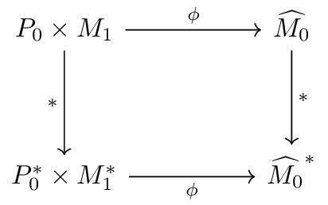

Our diagram shows two routes. First, a clockwise path where we pansharpen, then grade, and get a final pansharpened and graded image. Second, a widdershins path where we grade, then pansharpen, and get a final pansharpened and graded image. (It pleases category theorists to spell a comma as $\times$, so $P_0 \times M_1$ means _a pan₀ image and a mul₁ image_. Programmers can read it as a [product type](https://en.wikipedia.org/wiki/Product_type).)

Unfortunately, this diagram is wrong. Outside some special cases, we cannot change the order of pansharpening and grading and get the same results. In fact, both paths have conceptual problems. Those problems explain shortcomings in the real-world pansharpening we see in commercial imagery and on preprint servers.

To support these slightly ambitious claims, we will look at each path in turn.


#### The clockwise path: traditional pansharpening

The clockwise path takes pansharpening to have the function signature $P_0 \times M_1 \to \widehat{M_0}$. This is an operation from physically meaningful inputs (radiance or reflectance) to an output with the same kind of physical meaning. That output will, as a later step, be visualized.

This family of approaches includes most handwritten algorithms and many deep learning–based ones, and produces the great majority of the high-resolution satellite imagery available today. We’re seeing products of the clockwise path daily on commercial satellite maps, in news stories, and if we buy pansharpened imagery.

The problem here is that the figure of merit for pansharpening is perceptual difference. It’s not MSE, PSNR, MAE, or anything else in reflectance or radiance space. Pansharpening has no perceptual metric – and thus cannot be directly evaluated – in input-referenced space. The output of the clockwise path has no linear perceptual meaning.

Some readers will certainly object. They may argue that pansharpening is generally useful as a method of guided upsampling of multispectral bands as input for further algorithms. That was a reasonable argument when computing power was measured in Gflop/s. At that time, a thoughtful engineer could have said “We want NDVI at the highest resolution possible. To get this, we guided-upsample all bands, then take the normalized difference of the red and near infrared bands.”

Today, with Tflop/s in personal reach and Pflop/s in organizational reach, that engineering choice should be reconsidered from first principles. We almost certainly do not actually want NDVI. What we want is a reliable estimate of [LAI](https://en.wikipedia.org/wiki/Leaf_area_index), [AGB](https://ceos.org/gst/biomass.html), [fPAR](https://en.wikipedia.org/wiki/Fraction_of_absorbed_photosynthetically_active_radiation), or some other biophysical quantity in units with extrinsic meaning.¹ This is best estimated by a model with all bands as input. The model internals may very well do something pansharpening-like, or they may not; it’s not important. And as for NDVI, so for EVI, NBR, NDSI, NDWI, and all other direct applications of bands.

1. Someone may try to argue that no, they _do_ want NDVI per se, for data continuity. Oh? Just how continuous is WV-3 reflectance NDVI with ERTS-1 MSS NDVI? And if you want NDVI per se, why are you upscaling it?

In other words, pansharpening is not useful as preprocessing because we are no longer compute-constrained enough that we want lossy preprocessing. So pansharpening is no longer for algorithmic purposes. Pansharpening is only for human perception. And therefore, pansharpening into anything other than a perceptually referred space is inefficient.

For example, in reflectance, a 1% error in the brightness of a cloud top with albedo ~1 has more magnitude than a 10% difference in the color of a lake with albedo ~0.07. Therefore, if reflectance difference is the error metric, we will almost inevitably find perceptual issues in model tuning, whether it’s implemented by line-fitting, deep learning, local spectral correlation, or practically any other method.

Fundamentally, the clockwise approaches are trying to do something perceptual without applying perceptual ideas like [Weber/Fechner](https://en.wikipedia.org/wiki/Weber%E2%80%93Fechner_law)/[Stevens](https://en.wikipedia.org/wiki/Stevens%27s_power_law) scaling, let alone approximately perceptually uniform colorspaces. And so, as viewers of imagery, we are looking at the outputs of algorithms designed to minimize errors counted in units that have only loose relationships to what we actually see. I believe that the ringing artifacts, noise sensitivity, fuzziness in shadows, and pervasive inattention to hue and saturation are due in large part to misplaced trust in naïve linear metrics that are only defined in scene-referenced spaces.

The strengths of the clockwise methods in general are speed, because they will usually be implemented as a fairly tidy morsel of linear algebra, and reliability, because their artifacts are generally predictable and rarely extreme.

#### The widdershins path: en vogue pansharpening

The widdershins path takes pansharpening to have the function signature $P_0^\ast \times M_1^\ast \to \widehat{M_0}^\ast$. This is an operation from screen-referred images to a screen-referred image. It assumes that some kind of visualization or normalization was done before it runs.

This is the approach taken by much current pansharpening research, based on what I see on preprint servers. The screen-referencing done in this mode is sometimes explicitly conversion to a visible space, for example by clipping and gamma, but it may also be normalization, e.g., subtracting an input’s mean and dividing by its variance (z-scoring). Normalization is done because neural networks are known to train well with standard normal–distributed inputs. (In these cases, the data is output-referred, not screen-referred, but for our purposes here, it’s the same; what matters is that it’s no longer input/scene-referred.)

In the domain of images that can be scraped from the surface web, and therefore make up the training data of most large image models, and therefore (one fears) in the whole universe of natural images for some researchers, normalization is clearly good. It’s also common sense to remove all but the RGB multispectral bands. This converts satellite image data to the familiar domain that standard image models address.

However, breaking calibration loses substantial information and amounts to jittering the source interpretation, even by unjittering the value distribution of its information. The absolute brightness of things (or equivalently their reflectance) is related to _what they are_, and is therefore relevant to their correct pansharpening.

As an extreme example, imagine we have per-band normalized our inputs and are presented with an image chip that is mostly flat, with small, random spots. Are we looking at a playa with sensor noise? Or a desert with rocks? Or a desert with tufts of grass? Or water with whitecaps? Or smooth water with sensor noise? Water with ducks? Artificial turf with sports equipment on it? Real turf with divots? Artificial turf with ducks? Each of these scenes demands a different rendering strategy – if they don’t, then pansharpening is trivial – but we can’t distinguish them in normalized data. It’s no longer scene-referred, and we want to refer to the scene.

Similar arguments apply even if the normalization is per-image instead of per-band. Also to the practice of reducing multispectral data to RGB – we will make that explicit later. Related issues are treated usefully in the introduction of [Fleischmann and Arribas-Bel (2024)](https://www.sciencedirect.com/science/article/pii/S0198971524000760), where they coin the term _aspatial images_. The focus there is on scale and context, not radiometrics, but the parallels are illuminating.

To turn input-referred data into output-referred data by normalizing it in an unprincipled way, before actually working with it, is to move the data to a domain more people find familiar, but also to damage it. It is as if to unconditionally boil every cooking ingredient before using it, under the theory that it will make everything easier to cook. This technique will work out acceptably for some ingredients in some dishes, but it is not a wise tactic in general. And so with haphazardly normalizing data that has a defined relationship to relevant physical units.


#### The diagonal path: Potato’s approach

We cannot make grading and pansharpening commute, but we can draw a more accurate diagram of what’s actually happening:

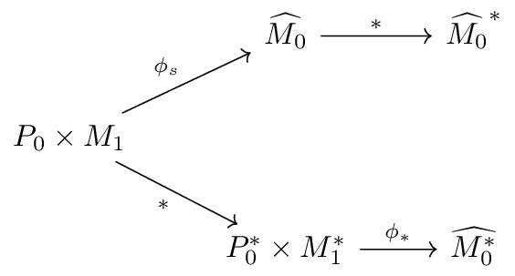

Where $\phi_s$ means pansharpening in the scene-referred space and $\phi_\ast$ meaning pansharpening in the display-referred space. (I do not love this notation, but at least it’s consistent with the well-established tradition of bad notation in discussions of pansharpening.) The gist of the arguments above is roughly that pansharpening should be _done_ in a scene-referred space but _evaluated_ in a display-referred space, so neither path is ideal. The clockwise or upper path works in the scene-referred space (good) but is evaluated there (bad). The widdershins or lower path works in scene-referred space (bad) but is evaluated there (good).

Potato takes pansharpening to have the function signature $P_0 \times M_1 \to \widehat{M_0^\ast}$: that is, pansharpening _is_ or at least _contains_ the conversion from scene-referred space to display-referred space. In the diagram, this would look a little like a commuting diagonal, doing what we might call scene-to-display pansharpening, $\phi_{s\ast}$:

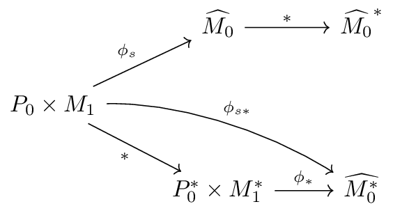

So Potato’s output, like the widdershins path’s output, is an estimate of the display-referred M₀. (While on the other hand the clockwise path results in a display-referred estimate of M₀.) Although Potato’s output is the same kind of object as widdershins output, Potato can produce a better element in that set given the same original input, because the model actually sees the original input. In other words, $\ast$ discards data, but Potato (and any other pansharpener that takes it path) gets to decide which data to discard.

Potato’s approach is determined by the arguments above. If a pansharpening model should take physically meaningful input and give perceptually meaningful output, it must be a function from the one to the other.

In terms of actual implementation, Potato takes linearly scaled ARD pixel data, in reflectance units, and gives pixels in the [oklab color space](https://en.wikipedia.org/wiki/Oklab_color_space), which is approximately _perceptually_ linear. Oklab has a well-defined relationship with the XYZ colorspace, which allows further correct conversions to sRGB (and indeed DCI-P3, and almost all other standard display color spaces). The reflectance to oklab conversion is covered in the next section.

### Notes on the pansharpening paths

A part of this analysis that deserves more working out than we will give it here is: exactly what counts as a grading ($\ast$) operation? Potato pansharpens into oklab in a way that is still mathematically equivalent to scene-referred XYZ. In a sense this is merely a reduction in band count, not in calibration. So Potato does not grade in the sense of actually applying any image- or intent- specific adjustments; arguably, it only makes the image able to be graded.

But the view taken here is that the null grade is a grade, and translating imagery into a display-, processing-, or specifically _perception_-oriented space is the threshold that matters for this analysis. The conceptually determining factor is that we are using a ΔE that is both direct (in the space) and correct (aligned to intent). So even though Potato’s output is still in equivalence with XYZ, and even though it is not adaptively graded, and even though it probably _should_ be graded further, in data terms it is in the world of perceptual meaning because that’s where its loss metric is. The fact that it still has recoverable physical meaning is interesting but not defining here.

A pansharpener with a codomain of the same bands as its domain, or XYZ for example, could in principle have a loss function implemented in oklab (or CAM16-UCS) with the appropriate transformation. In the terms used above, this would be indirect but correct. We would presumably have to categorize this as a $\phi_{s\ast}$-type pansharpener even though its output looked $\phi_s$-like. This would be annoying. But it would illustrate that the fundamental problem with $\phi_s$ is that its loss function does not correspond with its figure of merit.


# All-band color conversion

When creating an image from a sensor with red, green, and blue bands, a simple strategy is to copy their values (scaled in some way) into the red, green, and blue channels of an image in an RGB color space. This approach is on average acceptable, but it’s almost never the best we can do for a given pair of band and channel sets. The problem is that the colors the bands are sensitive to are almost certainly not the defined primaries of the RGB color space’s channels.

A way to address this problem would be to take the bands’ color coordinates (the _x_ and _y_ of the CIE 1931 chromaticity diagram) and, for a given combination of band powers, make a weighted sum of their colors. However, consider a sensor that happens to have three green bands. Clearly we do not want to take its output as _more green_ than the output of some more normal sensor observing the same scene. To avoid that problem, we could further weight by band width, but then we would hit another problem: how do we account for parts of the spectrum not covered by bands, or covered by more than one?

(To show my cards a bit: Potato is a personal project I decided to develop to releasable form, but one of its oldest peers is a project considering this band-gap problem in weather satellites. In some parallel universe, you are reading an apologetic aside about _pansharpening_ in the documentation of a _band simulation_ project.)

Of the many possible approaches to this problem, some involving spectral libraries, fancy linear algebra, etc., Potato takes a simple one. It considers the WorldView-2/3 bands as inputs to a very simple reflectance spectrum estimator. The method, starting before data prep time, is:

1. Randomly generate reflectance spectra (a.k.a. reflectance distributions) $\rho_\lambda$, covering edge cases such as pure black. (We follow remote sensing notation conventions: ρ is reflectance, λ is wavelength, L is radiance, etc.)
2. For each spectrum:
    1. Multiply the spectrum by the 8 bands’ response functions, giving the 8-band reflectance $\rho_8$.
    2. Illuminate the spectrum by the D65 radiance spectrum (which approximates sunlight), giving $L_\lambda$.
    3. Apply [the standard color matching functions](https://en.wikipedia.org/wiki/CIE_1931_color_space#Color_matching) to $L_\lambda$, giving the XYZ color. This is the appearance of the reflectance spectrum lit by D65.
    4. Produce a (multispectral, color) pair: ($\rho_8$, XYZ).
3. Over the ($\rho_8$, XYZ) pairs collectively, fit a positive transformation matrix `mul_to_xyz`.
4. At data prep time, for each multispectral image chip $\rho_8$:
    1. Create an [oklab](https://bottosson.github.io/posts/oklab/) version of the chip by going through `mul_to_xyz`, then converting to oklab. (Oklab is 1:1 with XYZ, but the function is nonlinear, so it can’t be represented in the multiplication by `mul_to_xyz`. We want oklab instead of XYZ because it gives us a fast and accurate perceptual loss function.)
    2. Create a training pair for the pansharpening model of $\rho_8$ as the _x_ or input and its oklab version as the _y_ or target.
5. At training time, learn the $\rho_8 \to \text{oklab}$ route as (the color part of) the pansharpening function. 

Other than the actual pansharpener, the only trained element of all this is the 8×3 matrix `mul_to_xyz`; most of the steps here are to get to it. We can sketch this process as:


This approach is, I believe, a strength of Potato’s _design_ compared to its peers, but also one of its weaker areas in actual _implementation_. We use synthetic, randomly generated reflectance distributions, but it would be better to include mixtures from a spectral library to ensure that the conversion is optimized for realistic SPDs, for example. It’s also inefficiently coded; there are more analytic and faster ways to do it. Even with its flaws, the method appears to improve on the state of the art.

The most important point in all this is that Potato is using _all visible bands_ to generate a color. This is an improvement on systems that map RGB bands directly to RGB channels because the colors are more accurate (for example, it gives us a virtual red primary that should closely match the red primary of your monitor) and because the colors are more complete (for example, the standard 3-band method applied to the WV-2/3 sensor is not able to record yellow light). In other words, the gamut of this method is more correctly aligned with output gamuts, and is larger.

To make a comparison of color conversion methods, we can run the demo script (using an image of Cianjur, West Java):

```bash
python tools/visualization/color_conversion_demo.py \
  https://maxar-opendata.s3.amazonaws.com/events/Indonesia-Earthquake22/ard/48/300020121333/2022-01-04/10300100CB626A00-ms.tif \
  naïve_color.tiff fancy_color.tiff
```

The images are too large to look at in full detail here, so we crop to the area around the [Cisarua Leather factory](https://cisarualeather.com/) at latitude -6.843, longitude 107.14. Here it is with the bands-as-channels approach:

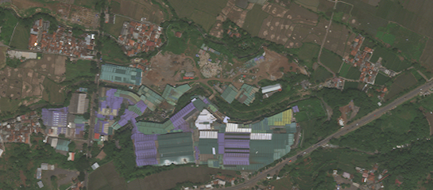

Keep in mind that no pansharpening is happening in this or in the next example image; the panchromatic band is not used at all in these visualizations. Here we are looking at color conversions of multispectral bands only. This is a (usually implicit) part of pansharpening, but is not the whole pansharpening process.

The same crop from Potato’s all-band conversion:

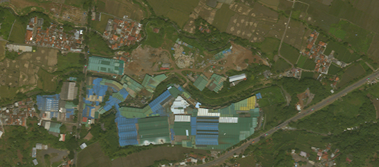

These are both lower-contrast than we’d generally want to see on a map. That’s good for their intended purpose, but not for comparison. There’s also a difference in color cast – the naïve version leaning red/purple, the fancy version leaning yellow/green – that’s due to different illumination assumptions (E for the RGB method, D65 for Potato), and is not important here because it’s easy to adjust. So for clarity, we’ll co-match their histograms and add some contrast, and also enlarge by simple pixel-inflation. Now we have this bands-as-channels image:

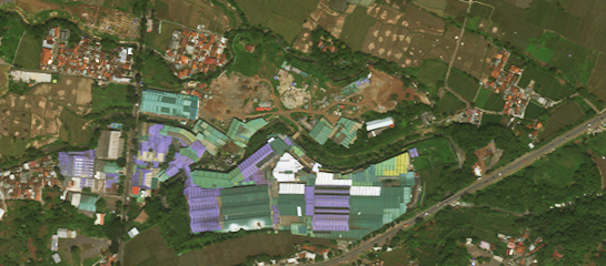

And this all-band image:

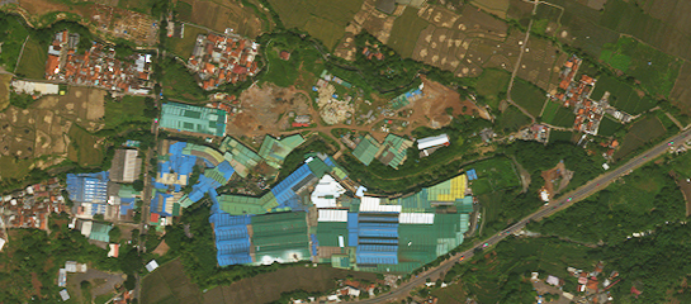

There are several interesting differences, but most are relatively subtle, and we are here to talk about the big one: the violet/blue roof color. The three-band method shows unambiguously lilac roofs. The all-band method has them as sky blue.

There are at least two testable claims here: that the three-band method is standard, and that it is less correct than the all-band method. I suggest the reader check some of the [various](https://maps.apple.com/frame?map=satellite&center=-6.843%2C107.14&span=0.006678323753437354%2C0.008749698382189308) [commercial](https://geojson.io/#map=17/-6.843/107.14) [imagery](https://www.bing.com/maps?v=2&cp=-6.843%7E107.14&style=h&lvl=17) [maps](https://www.google.com/maps/@-6.843,107.14,715m/) to confirm that – at least as I write this! – they all show shades of violet roofs.

We can also find examples with the history tool of the desktop version of Google Earth. Stepping back in the timeline from the current image to the first appearance of the roofs in question, in 2009, and skipping those badly obscured by clouds or their shadows, I find 36 distinct images (image credits: Airbus, Maxar, and Google, as given in each screenshot frame):

<details><summary>Large mosaic of screenshots</summary>


</details>

We can summarize them by a simple average:

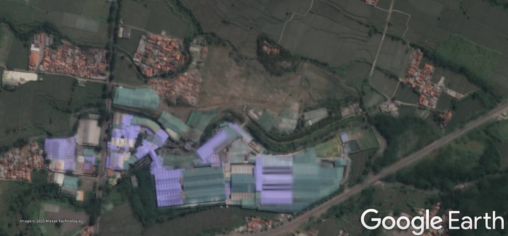

I think we can call it settled that the processing everyone’s using, across image wholesalers (Airbus, Maxar, etc.) and retailers (Apple, Mapbox, etc.) shows these roofs as somewhere in the lavender-lilac range.

But what is the roof’s actual color? 

We may refer [in-situ drone videos](https://www.youtube.com/watch?v=MLdckjstF3I#t=3m10s) or [Google’s own Street View product](https://maps.app.goo.gl/T9Dvrsg8HLY4YNsy9). It is indeed blue, as we would expect that type of roof to be.

I encourage skeptics to storm off and find their own examples. That’s what I’d do. Please find other lilac-in-commercial-imagery roofs in Manila, New Orleans, Colombo, Los Angeles, et alibi, and compare them to non-satellite sources. Here and there you will certainly find an actually lilac roof. I concede that there are some such roofs in the world. But I contend hat you will also find blue roofs consistently mis-rendered in satellite imagery.

So everyone is showing this roof as the wrong color, but we know how to do better.

This kind of large improvement in the rendering of certain rare surfaces is a good result, but better color methodology also gives us small improvements in the rendering of very common surfaces. These are by nature less striking to demonstrate, but they may be of greater ultimate benefit. The most important to me is slightly but noticeably better color in vegetation.¹ Yellow objects and red roofs may also improve noticeably, for example, as seen above. These are all more or less foreseeable consequences of using the conventionally neglected information in the yellow and deep blue bands. 

1. This is also involved with pansharpening proper, because the IR sensitivity of the panchromatic band is difficult to correct. It is often seen slightly overcorrected. I believe this contributes to the typically (but not universally) muted rendering of vegetation in most pansharpened satellite imagery, as seen in the screenshots above. Interestingly, vegetation there comes out looking noticeably less lush than in the three-band multispectral conversion. However, that is a topic of its own, and we are embarrassed for choice of issues to demonstrate, so will will be content with the lilac/blue demonstration and move along briskly. You should see the drafts of this document before I edited it down to a few key examples.


## Other advantages of all-band pansharpening

What we’ve seen above (other than the Google Earth screenshots) is not pansharpening. The example images were only from the multispectral bands, and were not sharpened by the panchromatic band. In principle, we could use the sRGB image made from all bands as input to a pansharpener that expects RGB channels-as-bands, and it would presumably improve the color fidelity of the output. However, there are reasons to think of pansharpening itself as a function of all available bands. Two of these reasons are noise and landcover classification.

_Noise._ There is little noise in this imagery. What remains, however, is remarkably difficult to characterize and mitigate, and to separate from other complex issues, such as band misalignment (the topic of the next section). If the bands were independent samples of the same underlying signal, going from 3 to 8 bands would give us a signal with only ~61% as much noise. Actually, the bands are neither independent (as some kinds of noise correlate inter-band) nor sampling the same thing (as they see different parts of the spectrum). Nevertheless, it’s reasonable to expect a well-trained model to cope better with – for example – an outlier signal in 1 band out of 8 than in 1 band out of 3.

_Classification._ Pansharpening should be conditioned on surface composition. (This is another facet of the argument against instance normalization.) For example, imagine a big block of green next to a big block of brown, with some high-frequency detail but no clear boundary in the pan band. If the green surface has the spectral signature of artificial turf and the brown surface that of brick, the optimal pansharpening is probably a sharp edge. But if it’s live grass adjoining bare soil, the optimal pansharpening is probably an irregular gradient modulated by the small details in the pan band. This is roughly what’s happening in the Quito example in the main readme of this project. (We might also imagine swirling v. bushy texture on something that could be algae or trees, or ripples v. corrugations on a surface that’s either a pond or a roof.)

To turn this point around, pansharpening is not merely the guided upsampling of abstract shapes. What’s in the pictures matters. It’s easier to tell what’s in the pictures with all the bands.


# Point spread functions and band misalignment

Potato trains with a specific kind of band misalignment injected into the training data, to emulate sensor-specific artifacts. This section explains those artifacts and Potato’s general approach.

Imagine an ideal multispectral digital sensor’s output. Each pixel in each band represents a perfect integration of incident light over a given segment of spectrum, over a given square of the image plane, without overlaps or gaps. The data we’re working with comes remarkably close to this ideal. (Especially when compared to raw photos from cameras with Bayer arrays.) But it is, of course, not perfect.

## Point spread functions

The data we’re considering tends to be slightly oversharp, meaning the point spread function has small negative lobes, and we see [ringing artifacts](https://en.wikipedia.org/wiki/Ringing_artifacts) around very high contrast edges. The severity of the effect varies between sensors, between images, within images, and directionally, for guessable but undocumented reasons. In Potato it’s addressed by injecting sampling jitter, which is easiest to describe as part of:

## Band misalignment

Band misalignment is also called, for example, band-to-band mis-registration (BBMR).

<details><summary>2,500 word sidebar on the causes of band misalignment</summary>

_The following contains both significant simplifications and relatively heavy technical detail. It also makes guesses about aspects of satellites’ sensor designs. I welcome corrections that are sourced to reliable public information._

A general observation about image sensors is that it’s impossible to collect a full range of colors, over a whole field of view, in one instant, at high quality. Our eyes do not do this; film cameras, despite the occasional claims of their most committed fans, don’t either; and neither do $10 billion space telescopes. The fuzzy part of the claim is “high quality”. A more engineering-minded statement is that there is always some tradeoff among the resolution of wavelength, of angle, and of time. Consumer cameras, for example, give up angle: by using Bayer arrays, they do not actually collect everything in the frame.

The imagery we’re interested in here is collected by [pushbroom sensors](https://natural-resources.canada.ca/maps-tools-and-publications/satellite-imagery-elevation-data-and-air-photos/tutorial-fundamentals-remote-sensing/satellites-and-sensors/multispectral-scanning/9337). These rely on the motion of the satellite’s orbit to sweep smoothly across Earth. (Or on satellite pointing, but the result is similar.) They give up time: instead of collecting whole frames, they collect only a single line of pixels per band, and these are stacked into 2D records where one dimension is extent in space and the other is extent in both space _and_ time. Imagine a photograph where each row of pixels is from a millisecond after the one above it.

In the optical system of the satellite, light from a single line of Earth’s surface (ignoring things like clouds for the moment) is diffracted into a spectrum, reasonably similar to the one cast by an ordinary prism. It can be imagined as looking like this, where the white line moving across the center of the scene on the right is being diffracted – split by wavelength – into the spectrum on the left:

[](https://www.youtube.com/watch?v=y7KLyO2zXi4)

_Click through to video. This is a simplified visualization of a line of an image being projected to a spectrum. Play fullscreen for greatest clarity, and see main text for notes. Source data: © Maxar, CC BY-NC._

The spectrum is two-dimensional on the plane. Its _y_ axis (up and down) is the same as _y_ in the scene space, or distance on the white line. In other words, as the white line crosses something, we can look directly to its left and see that thing’s spectrum aligned with it. In the scene’s space, the _x_ axis is also physical space, but in the spectrum, _x_ is wavelength, from indigo to red. If we place light sensors in strips along colors in the spectrum, each strip can measure a different band of wavelengths. These are the bands we’re talking about in multispectral imagery: bands of the electromagnetic spectrum, but also long belts of sensor pixels.

Imagine that we recorded a vertical line through the green part of the spectrum over time. Instead of playing it back in time, as an extremely narrow animation, we could lay it out in space, as a 2D image. This is a <a href="https://paulbourke.net/miscellaneous/slitscan/">slitscan</a>: a rotation of a row of video pixels from _x_, _t_ space (a line seen over time) to _x_, _y_ space (a flat image). If we imagine a video as a 3D solid of pixels that we are seeing many slices of each second, a slitscan means to slice through successive planes of pixels in either of the other directions: video from the side, so to speak. Here’s what a slitscan of the 480th column of the video looks like, rotating it from extending in _y_ and _t_ into extending in _y_ and _x_:


(I’m using <a href="https://gist.github.com/celoyd/cd0a827b17eb7e75d2451bc677229d63">this script</a>; it should be reasonably straightforward to replicate. Your results may show artifacts from video compression. Also note that, as usual in this documentation where absolute characteristics are not in question, I am resizing, color-balancing, etc., for your clarity and my convenience.)

This rotation around dimensions is exactly equivalent to what the satellites are doing. Putting aside many complicated details, looking narrowly at the fundamental concepts, this is how a green band is recorded. The bands of pushbroom satellites are slitscanners.

A practical problem in satellite optics design is that it’s hard to get all the information out of a single spectrum. For example, we want a panchromatic band that detects more or less all visible light (meaning it’s as wide as the whole spectrum), but also multispectral bands that only collect subsets. Overlapping them would require splitting the spectral light, adding complexity and noise. Also, bands are easier to engineer if they have space on at least one side, for ease of wiring.

Therefore, imaging satellites typically cast multiple spectra, each onto its own detector sub-array. To do this without dividing the light among spectra, each spectrum must draw from a different strip of light from Earth – a different line, as visualized in the video. We can imagine three parallel lines on the scene as it scrolls, casting three spectra onto three sub-arrays. But a problem arises: the problem that we are here to understand.

Let’s explore this multi-line arrangement in a more familiar and easier-to-demonstrate context. To do that, we need a video. Our proxy for a satellite’s view will be <a href="https://commons.wikimedia.org/wiki/File:Giant_BLM_street_sign_in_Kensington_Market_-_Black_Lives_Matter_-_Street_Art_Paint_Painted_Sign_-_Drone_video_DJI_Mavic_Mini_-_Flying_Left_to_Right_-_Friday_July_3,_2020_-_5-25pm_-_Creative_Commons_Attribution.webm">this clip by Jason Hargrove</a> (<a href="https://creativecommons.org/licenses/by/2.0/deed.en">CC BY</a>), because it’s a nadir-pointing view, in relatively smooth motion, of a scene with some depth, color, and internal motion, and it’s openly licensed. Please watch the video with a spatiotemporally critical eye. If we slitscan its 1000th column (about halfway along: it’s 1920 pixels wide), we get this:


This is made with <a href="https://gist.github.com/celoyd/cd0a827b17eb7e75d2451bc677229d63">the same script</a>, run like so:

```sh
python slitscan.py frames c1000 c1000.png
```

If we look at this as an attempt at an accurate map, instead of as an off-label use of a video meant as a video, it has many shortcomings. One is its aspect ratio. The _y_ dimension (up and down on the screen) and the _x_ dimension have different scales. To make it roughly conformal, we will arbitrarily squeeze the image, here using ImageMagick’s `convert` utility:

```sh
convert -filter Box -resize 100%x20% c1000.png c1000-flat.png
```

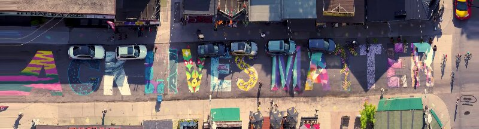

We can see, for example, the “torn” letter A. This is from the beginning of the video, before the drone is in motion. In a slitscan, the more time something spends intersecting the column we’ve selected, the longer it is in the resulting image. And indeed the cyclists near the right edge, who were riding against the drone’s direction of motion and thus intersected the column only very briefly, are compressed.

Now we have built the principles and intuitions to see what we came to see. Here we slitscan the frames of the video on three different columns, separated by 100 pixels:


```sh
# we actually already did the first one, but let’s leave it for clarity
$ python slitscan.py frames c1000 c1000.png
$ python slitscan.py frames c1100 c1100.png
$ python slitscan.py frames c1200 c1200.png
```

These are records of a line across the track direction at three slightly different angles in the along-track direction. Compared:

```
$ montage -mode concatenate -filter Box -resize 100%x20% -tile 1x c1{0,1,2}00.png comparison.png
```

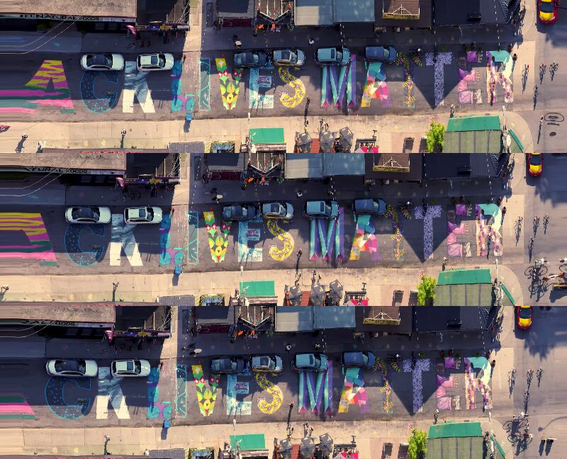

The images are offset, which we are about to correct, and other differences will become more obvious. To more clearly emulate the satellite’s setup, let’s look at only one band (or channel) per slitscan – imagining that each one is a different detector sub-array. Also, we can measure the _x_ axis offset between bands, using the left foot of the M as a reference, at about 16 pixels, so we can align them by placing them in a slightly wider image (using [gravity](https://www.rubblewebs.co.uk/imagemagick/notes/gravity.php)).

```
$ convert -size 832x1080 xc:black \( c1000.png -channel R -separate \) -gravity west -composite -filter triangle -resize 100%x20% red_l1.png
$ convert -size 832x1080 xc:black \( c1100.png -channel G -separate \) -gravity center -composite -filter triangle -resize 100%x20% green_l1.png
$ convert -size 832x1080 xc:black \( c1200.png -channel B -separate \) -gravity east -composite -filter triangle -resize 100%x20% blue_l1.png

$ montage -mode concatenate -tile 1x {red,green,blue}_l1.png band-comparison.png
```


Merged into an RGB image:

```sh
$ convert {red,green,blue}_l1.png -combine rgb_l1.png
```


Here we have recreated band misalignment. Without a platform as smoothly moving as a satellite, we have some artifacts due to sensor acceleration alone: the torn letters at the left margin, where the drone was just starting its pass. <!-- Just as the lack of real motion (of cars, for example) in the animation above was a limitation of its source data, the unstable perspective is an artifact of this data. --> But other features have close analogs that appear in the pushbroom satellite imagery that this project is about. We will consider motion offset, then height offset.

Motion offset follows immediately from the sensor’s entangling of angle and time. Because different bands see the same point in space at slightly different points in time, the colors of anything in motion are seen in different places. In the image we made from the drone video, we see this on pedestrians and cyclists. In many satellite images, it’s most noticeable on cars on highways. From a typical very high resolution satellite, we might see a (red, green, blue) car at _t_ = 0 seconds, _x_ = 0 meters, θ = 0 mrad; then a panchromatic car at _t_ = 0.15 s, _x_ = 3 m, θ = 1.25 mrad; then a (red edge, yellow, blue edge) car at _t_ = 0.3 s, 6 m, 2.5 mrad. (These numbers are approximations of WorldView-2’s parameters as worked out by [Kääb (2011)](https://www.mn.uio.no/geo/english/people/aca/geohyd/kaeaeb/kaeaeb/kaab_ieee_grss_fusion_2011.pdf) and [Krauß (2014)](https://www.researchgate.net/publication/280744253_Exploiting_Satellite_Focal_Plane_Geometry_for_Automatic_Extraction_of_Traffic_Flow_from_Single_Optical_Satellite_Imagery). Both papers are worth reading if you’re interested in this topic, and both have helpful illustrations beyond what I have attempted here.)

Motion offset is a complicated topic, but once we know how these sensors work, its _cause_ is nice and straightforward: different color components of an image are recorded at slightly different times.

To think about height offset, consider the 16 pixel shift we applied to the R, G, and B images from the drone. That distance came from measuring the offset between raw bands using a fixed point on the ground. Each horizontal pixel is one frame in the video, and the video has 30 frames per second, so we know the time offset of the bands was 16/30 ≈ 0.533 seconds. More accurately, we know that the time offset of the bands _at that point_ was about 0.533 s. Even if the drone’s point of view were a perfect linear translation, and even if there were no real-world motion within the scene, not all points would appear to move at the same speed relative to the video frame. There is another dimension in play: the scene varies in height. Therefore, in the image space – in other words, as measured in pixels – the roofs of buildings are moving faster because they’re closer to the sensor.

This is parallax, an aspect of perspective so familiar to sighted people that it can be hard to think about abstractly. If we shift our heads from side to side while looking forward, closer things have more _apparent_ motion – they move more in image space. This is so useful that we have evolved a way to see from two horizontally separated places at once without having to move our heads, and to fuse these two images into a subjectively mostly unitary experience.

The equivalent of this fusion is terrain correction, a difficult problem in satellite image processing. We can find the latitude and longitude of each pixel in each band by working backwards from the satellite’s position, the pixel’s angle, and an elevation map of Earth. Conceptually, we are projecting the image from a virtual satellite back at a blank 3D model of Earth and seeing where each pixel falls. Then we warp the image to a standard projection by smoothly pushing and pulling each pixel from where it sits in the raw image to the projection of the coordinates of the point it landed on in the 3D model.

But all this can only be as good as the 3D model is – and 3D models are rarely great. Away from the parts of the world with lidar surveys and the like, the best available data may be things like [SRTM](https://www.usgs.gov/centers/eros/science/usgs-eros-archive-digital-elevation-shuttle-radar-topography-mission-srtm-1) and [ASTGTM](https://lpdaac.usgs.gov/products/astgtmv003/), both of which have only ~30 m resolution and are never as up to date as one would want. We can see traces of this problem in almost any imagery that’s terrain-corrected (without which it’s more or less useless for mapping). It’s especially clear where we find lines that we know should be straight in the real world, and that stand on or over rugged ground that has changed since the terrain data was updated. New airports are a good place to look for this:

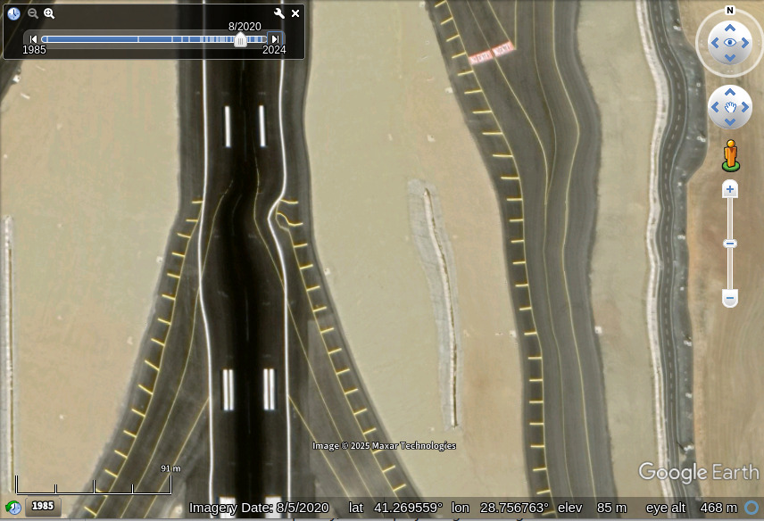
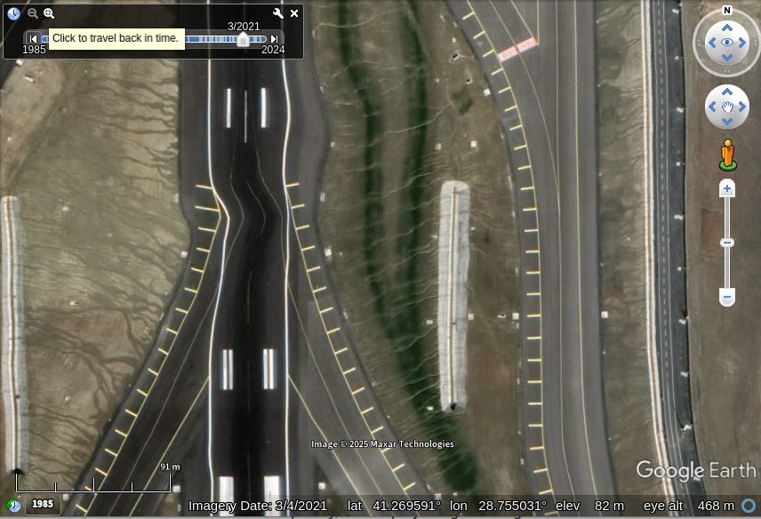

_Istanbul Airport (IST)’s runway 36/18, completed June 2020, as shown for two dates in Google Earth. The view is from directly overhead, so display-layer warping should be virtually zero; we’re seeing something close to the 2D source data. We can of course watch [videos](https://www.youtube.com/watch?v=H5uHy5p2Ucs#t=4m30s) [by](https://www.youtube.com/watch?v=DjHUHPUS33o#t=23m30s) [pilots](https://www.youtube.com/watch?v=qL3KOv0cjBI#t=14m45s) showing lines that appear perfect to the limits of distortion in the cockpit windows and the camera lens system._

So the shortcomings of terrain models cause problems, but there’s a deeper issue. We don’t exactly want terrain models. Earth’s _terrain_ surface is not really what we’re mostly seeing in visible-light images of “land”. We’re mostly seeing grass, trees, and buildings. If the angle between WorldView-2’s first and last bands is 3e-3 radians, and the bands are aligned at the ground surface, then, by [the small-angle approximation](https://en.wikipedia.org/wiki/Small-angle_approximation), a tall building of 300 meters has an offset at its top equivalent to 3e-3 × 3e2 = 0.9 meters. This amounts to a very short-baseline stereo pair being treated as a single image. As with any stereo pair, for views of complex 3D subjects there is no _trivial_ way of fusing the images. <!-- The primary visual cortex in humans has about 140 million neurons. -->

So why not use a surface (or “canopy”) model instead of a terrain model? That is, if it’s a problem for the visible surfaces of things to be above the ground we’re modeling, why not model the visible surfaces? Two reasons. First, the available data is even worse. No one has a reliable, realtime map of the shape of every building and tree and bunch of grass in the world at any scale. Second, the modeling is very difficult. Canopies have more discontinuities at the 0.1 to 10 m scale than ground surfaces do. (This is why we can’t align by cross-correlation alone. The warp map would be full of jumps.) Imagine trying to project an image of a radio tower onto a 3D model of it. Even given miraculous perfection in all other aspects, the wind making it sway a little would be enough to pull everything out of alignment. And what would we use to fill data in band A that was only seen by band B?

Clouds are another example. They are often high above the ground,<sup>[citation needed]</sup> and they are notoriously transient. There is likely no more precise source of truth for what a given cloud looked like at a given moment than the image we are looking at while wondering. If we imagine trying to correctly place the cloud above the longtiude and latitude where it actually was (filling the now-exposed Earth surface pixels with what?), that’s only a more extreme version of trying to reconcile the three slightly different images of a tall building. Or consider the artist James Bridle’s [rainbow planes](https://www.youtube.com/watch?app=desktop&v=eD8r9LjcwAc) – aircraft present most of the challenges of clouds plus high speed.

Thank you for attending this sidebar on the causes of band misalignment.
</details>

To see band misalignment caused both by height and by motion, let’s look at an image of tall buildings by a highway. We’ll use [the Bahria Icon Tower](https://en.wikipedia.org/wiki/Bahria_Icon_Tower), in Karachi, in Maxar 10300100D404DA00 (2022-06-24). (I’ll be resampling and brightening these images arbitrarily for clarity of visualization. It was a dusty day in Karachi.)

In the panchromatic band:

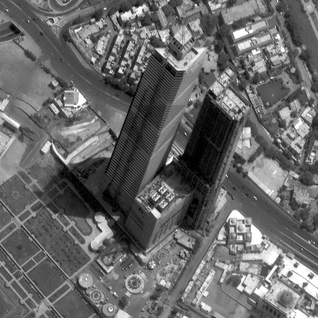

In the R, G, and B bands:

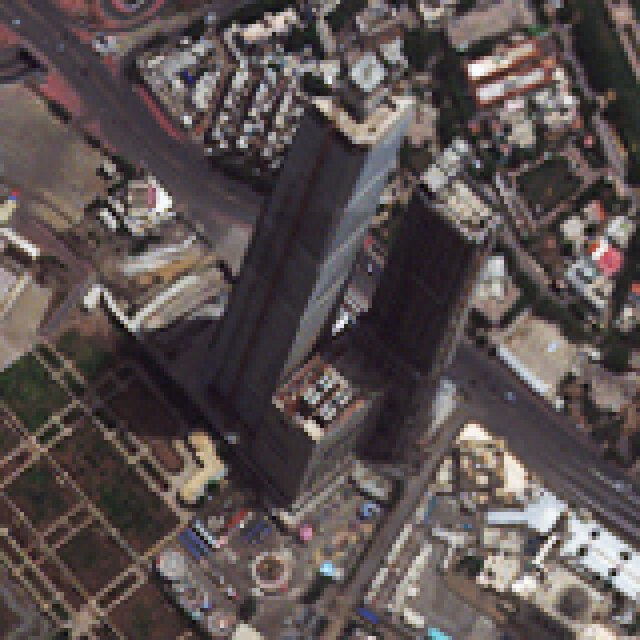

In the red edge, yellow, and blue edge bands, mapped to RGB:

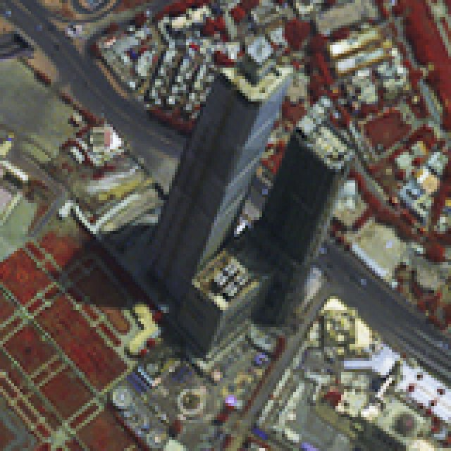

The band layout of the sensor (per [Kääb 2011](https://www.mn.uio.no/geo/english/people/aca/geohyd/kaeaeb/kaeaeb/kaab_ieee_grss_fusion_2011.pdf)), in order of observation, is: near infrared 2, coastal blue, yellow, red edge, then a much longer gap, then pan, then the same longer gap, then blue, green, red, and near infrared 1. (This fits the fact that motion artifacts in WV-2 imagery run _ahead_ of the object, because the three-band conversion’s RGB bands are, presumably by a careful design choice, all on the same sub-assembly: the one that sees moving objects further along their track.) This means that there is minimal motion separation within the two images above. But they are offset to each other:

<details><summary>Wigglegram animation cycling at ~3 Hz (possible epilepsy trigger and definite annoyance)</summary>

<!-- magick -delay 30 cropped/{4,5}.tiff -loop 0 -sample 400% -auto-level -gamma 2 -sigmoidal-contrast 5,50% karachi-loop.gif -->

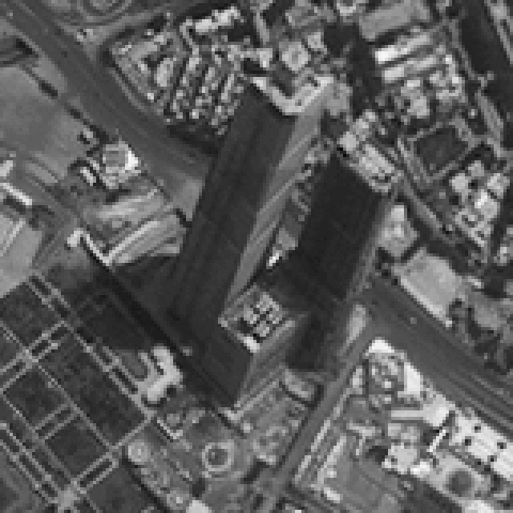

_Alternating between the red and yellow bands every 0.3 seconds, roughly their actual difference in time – note the plausible speed of the cars. The tops of the buildings show the ~1 meter offset estimated above. Because the yellow band is first and the imager travels north-to-south, the building top appears further north in the red band. There is also some offset of the ground, which is other error not accounted for here._

</details>

We would probably find a wide range of reactions to this artifact among different people doing their different things with imagery. For some, it would be unimportant; for a few, it might be a severe problem; for most, probably, it would be a small problem. If it is a problem, it has no perfect solution. (For several reasons, but as a backstop argument, because there are parts of Earth’s surface that some bands saw but others didn’t: the information simply isn’t there to be recovered.) Therefore, for those of us who want to pansharpen, there are many reasonable but incomplete approaches to it.

One strategy for band misalignment is to ignore it. This is the approach taken by most pansharpening research. Where the goal is to explore some limited aspect of pansharpening, this may be justified, but it will not work for real-world applications. It will, in fact, tend to _magnify_ artifacts.

<details id="Wald"><summary>Sidebar on Wald’s protocol and associated scale problems (for the pansharpening superfans)</summary>

_Here, resolution and sampling are always in terms of 1D length, not 2D area: for example, resampling a 10×10 grid to a 5×5 grid would be called 2× downsampling. Also, for simplicity, we assume that the pan:multispectral resolution ratio is 4:1; this holds for the data used in this project (WorldView-2/3), and most comparable data (e.g., Pléiades Neo), but not for all pansharpenable imagery (e.g., SkySat, Landsat 8/9)._

A problem upstream of many other problems in pansharpening research is a lack of full-scale training data. This problem is often mentioned in the literature and rightly so. Pansharpening is an extrapolation of imagery’s spatial resolution, and we have virtually no ground truth at the scale that we want to extrapolate _to_. The ideal training data would be hyperspectral, to match band responses, and with a ground sample distance finer than about half the real data’s, to allow for sampling artifact injection – and it would be plentiful and cover a wide range of landcovers. This is simply not available. A widespread workaround is called Wald’s protocol (from [Wald et alia (1997)](https://www.asprs.org/wp-content/uploads/pers/1997journal/jun/1997_jun_691-699.pdf), despite that paper crediting earlier work). It downsamples full-resolution data into P₁ and M₂, so that the function being modeled is (P₁, M₂) → M₁. This approximates, and is applied as, (P₀, M₁) → M₀.

It’s not a perfect approximation because M₁ does not look exactly like M₀. Of course it doesn’t for any _specific_ M₀, but also in a general, statistical sense: if I give you an interesting satellite image, you can do far better than chance at guessing its scale. And pansharpening should depend on scale. If we could poll everyone who thinks about these things, I think we would find disagreement about the degree to which this holds, but I would be toward the _more_ side. Some examples of plausible scale-dependence in a deep learning–based pansharpener:

- We should expect a model seeing a patch of green surrounded by a fallow field to decide whether it is a relatively soft-edged patch of grass or a relatively sharp-edged tree canopy in part by having an assumption about the typical size (in pixels) of a tree.

- Most objects that the model will see in training that are moving quickly will be cars. Objects in motion must be treated specially. There are other artifacts, and conceivably even real features, that might appear similar to motion artifacts, and the model is likely to use information on whether the feature is car-like to help resolve ambiguity. But cars have a characteristic scale. A model trained on (P₁, M₂) but applied on (P₀, M₁) will have false-negative failures to apply car logic to real cars. It might even have false positives where cosmic rays, birds, etc., incorrectly trigger car rendering rules.

- Band misalignment, an error measurable in length, is necessarily scale-dependent. Suppose that the standard deviation of all-cause band misalignment is 0.1 pixel in M₁. It will then be 0.025 px in M₂. Therefore, training on (P₁, M₂) → M₁ is training to quadruple misalignment artifacts – to find them and scale them up. Inference on (P₀, M₁) → M₀ will then presumably result in final imagery with a standard deviation of band misalignment of 0.4 px. In technical terms, yikes. (A similar argument is available for point spread functions.) Naïvely feeding the model source data that has had artifacts reduced by downsampling, paired with target data with real artifacts, is teaching artifact magnification exactly as much as it’s teaching feature magnification.

The first of these examples would hold even for pansharpening ideally sampled data of real scenes, the third would hold even for real images of completely artificial test patterns, and the second concerns both real features and real sensors.

The argument here is not against Wald’s protocol but for careful contemplation of its consequences. The paper that popularized it is a key contribution to the painfully sparse theory of pansharpening; it is arguably the closest thing we have to a foundational text for conceptualizing what this is all about. The rarity of that kind of work is a shame for the field, which may be small but still deserves a serious theoretical literature. Without reflective conversations about what we’re doing, how we’re doing it, and what our results mean, pansharpening as applied and pansharpening as researched have diverged into two half-fields. The dysfunction is not absolute, but it is serious; probably about half the people taking pansharpening seriously are authors on [a single paper](https://ieeexplore.ieee.org/document/9844267). Mostly, on the research side we find deep learning techniques that proceed from the assumptions of aspatial imagery and fail severely on real data. On the applied side, equally partial in its grasp on what’s actually important and interesting in pansharpening, we have:

</details>

Another strategy, used by classical methods like those seen in Maxar’s in-house pansharpening and on Google Earth – as far as I can interpret them without documentation – is to use only the RGB bands. This helps because they’re aligned with each other (presumably by design), thereby cutting the problem roughly in half. Processing also effectively low-passes them. Therefore, many small problems are hidden by the blur. The disadvantage is that, at least on the chroma planes, it makes blurry imagery.

<!-- https://pubs.usgs.gov/of/2021/1030/p/ofr20211030p.pdf -->

Potato tries a third strategy. It comes in part from using all-band color conversion, which basically doubles the color artifacts: they will appear on both sides of a moving (or tall, or otherwise off–terrain-model) object. This makes them too obvious to ignore. The strategy is also a response to the promises and limits of deep learning, which is able to address some remarkably complex nonlinear problems, but only if they’ve first been framed carefully. The approach is to inject band misalignments into the source side of the training pairs, as an augmentation. In other words, we try to show the model something that looks _roughly_ like band misalignment, so it learns to correct it. Here’s how that works, to a moderate level of detail. Given an image chip with multispectral bands of size 8×128×128, which we might visualize in RGB like so (upsampled for clarity):

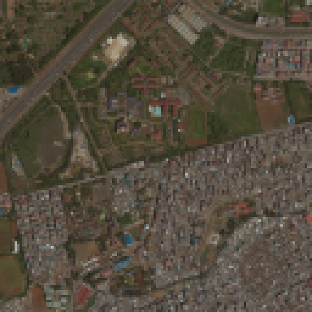

We create a 2×h×w offset field of noise, of a chosen frequency distribution, that’s faded to zero at the edges. One of its “channels” can be visualized like this:

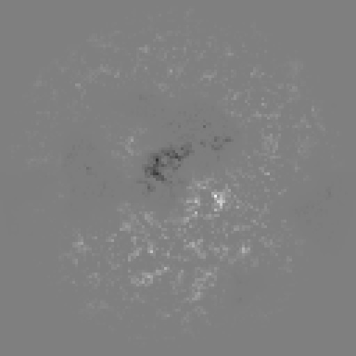

Where medium gray is 0 offset, dark is negative, and bright is positive. Or, alternatively, taking the channels as oklab _a_ and _b_:

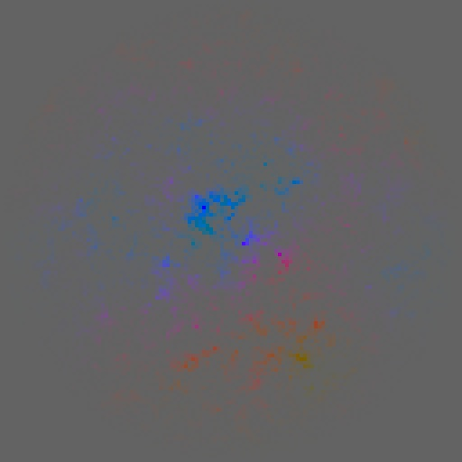

Then we [warp](https://docs.pytorch.org/docs/stable/generated/torch.nn.functional.grid_sample.html) the image by the offsets (i.e., using the channels as _x_ and _y_ flow or motion vectors) – the front band sub-array offset positively and the back bands negatively. (The polarity is arbitrary because the offset field is random with 0 mean, so on average the front bands will be shifted in any given direction as much as the back bands.) In other words, the field is used to set the direction and amount of band group splitting. The image now looks like this:

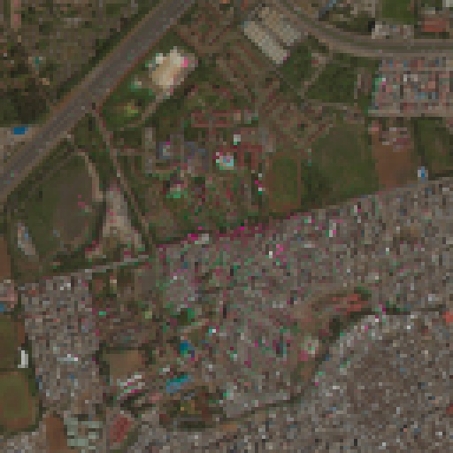

This loosely approximates an image with various sources of band misalignment in it. While not a very good approximation when closely examined by a human who understands what objects tend to be in motion and what their boundaries are, it appears to sufficiently guide the model to detect and “close” band misalignment artifacts.

We also inject some point-spread function noise by sampling images from the sharpness space {extra,inter}polated from the range of the original image to its slightly blurred version. This simulates softness and oversharpness (ringing).

In all of this, the panchromatic band’s data is untouched, save for modest sharpness/softness noise. The aim is for the model to learn to use the pan band as the positional reference that anchors multispectral misalignments.


## Appendix: Minor techniques

A number of techniques used in Potato are worth noting without fully exploring:

**Oklab.** The oklab color space is approximately perceptually uniform, so Potato uses a color loss term that is simply Euclidean distance within it. This is a more correct version of the mean absolute error of (implicitly sRGB) color values that many image processing models use. Oklab has its quirks, but it excels at this task.

**Using the Maxar Open Data repository.** This is, so far as I know, the largest assembly of highest-resolution satellite data that has ever been openly available. Its landcover distribution is not exactly what a researcher might request, but it’s good. Training on this repository rather than on a few scenes is an enormous advantage. Naturally its license entails some constraints, but for those of us interested in the problem in itself, it’s an outstanding resource. (Those with a commercial need for pansharpening presumably have their own data.)

**Double downsampling.** Notwithstanding implications elsewhere, Potato actually trains on $P_2 \times M_3 \to \widehat{M_2*}$. This implies a dependence on large volumes of training data. And it means the model sees imagery that is even more removed from the inference (real) scale than it would with singlefold Wald. This is a serious disadvantage. I believe the model materially suffers from a lack of examples of, for example, large non-water blue objects. On the other hand, this approach makes for much cleaner target data. Specifically, it much reduces the artifacts in the training _y_. Its problems are partly offset by:

**Synthetic chips.** I noted colors in outputs that the model rendered poorly or that were associated with artifacts. These were – as one would guess – mainly unusual and artificial colors, like bright paint on shipping containers. Often, the output contained distortions that I took to be a form of scale-dependence. For example, in one common case, [a blue roof would have well-rendered edges, but its center would have color and texture distortions](https://github.com/celoyd/potato/issues/51). I interpreted this as the model struggling because it had never seen more than a few pixels of such blue together, and was significantly out of distribution. To address this, Potato includes a synthetic chip generation utility called [difficult-colors](https://github.com/celoyd/potato/tree/main/tools/difficult-colors). This approach can be understood as a form of hard negative mining. The (visible projections of) the synthetic chips look like this:


The goal is to present the model with mixtures and sharp boundaries between different difficult colors, in complex and realistic enough patterns that it does not learn to recognize synthetic tiles as their own distribution. I think this level of complexity probably barely suffices, and a larger model would need a more subtle approach. Mixing these into the usual data at a rate of about 1/32 seems to be about right.

**Avoiding clouds.** To avoid showing the model target imagery with offsets as large as those seen on clouds, even with double-downsampling, I filtered inputs to only completely clear ones. (With one exception that had a wisp of cloud but was otherwise extremely beautiful.) See the [allow-list documentation](https://github.com/celoyd/potato/tree/main/tools/allow-list) for more.

**Mixing WorldView-2 and WorldView-3 data.** Many pansharpening approaches that seem pretty unrigorous nevertheless conscientiously treat WV-{2,3} as independent systems that need separate models. However, open documentation – [_Radiometric Use of WorldView-2_](https://dg-cms-uploads-production.s3.amazonaws.com/uploads/document/file/104/Radiometric_Use_of_WorldView-2_Imagery.pdf) and [_Radiometric Use of WorldView-3_](https://dg-cms-uploads-production.s3.amazonaws.com/uploads/document/file/207/Radiometric_Use_of_WorldView-3_v2.pdf) – shows them as functionally identical in virtually all ways relevant to pansharpening. Their shot noise levels and atmospheric correction may differ, but not enough to be one of the largest parts of any plausible error budget. (As a backstop argument, if they _do_ have significant differences, we would expect a good model to notice them and be bimodal.)

**No sharpness bias.** People developing pansharpening techniques like to show that their work produces sharp outputs. But a slightly undersharp image and a slightly oversharp image are about equally useful; it’s easy to turn one into the other with very little loss. Problems arise when they are _very_ under- or over-sharp, which starts to entail actual information loss. The sensible aim point is images as sharp as the world is. Users who prefer slight oversharpness are welcome to apply an unsharp mask or similar. There is certainly more to this from a signal processing perspective, but I don’t think it changes the practical analysis.

**Diagramming.** As mentioned near the top of this page, mapping the conceptual space around pansharpening in a loosely categorical style has helped to expose assumptions and suggest interpretations. However, there are some drawbacks. It will infuriate category theorists to see their sharp tools used as hammers, it will irritate programmers who would rather see code, and it can be slightly alarming:


At top, in red, we imagine that there is some perfect image that is multispectral at full resolution, $M_0$. The satellite’s observation of this is essentially the inverse of pansharpening ($\phi^{-1}$), which represents the scene as panchromatic and multispectral data at received resolution, $P_0 \times M_1$. On the right are the three kinds of pansharpening ($\phi_s, \phi_{s\ast}, \phi_{\ast}$), as in the diagram above that introduced Potato’s diagonal path but rearranged slightly to fit. Notice their backward Z profile. Below, we downsample ($\frac{1}{4}$) to get training-scale data. Training an $f$ to perform a given morphism is written $t(f)$, and no attempt is made to fully represent everything involved in _that_ process; it would look like a tragic explosion in an arrow factory. But note that the Z shape of the leftmost wing reflects the shape of the three-method diagram: it’s the same three. In projections we use the convention input _x_ × target _y_.

Were I implementing a pansharpening project in a strongly typed language, I would use this diagram as a starting point – for example, $P_0 \times M_1$ might be implemented as a type `PanMulFullres` with a method for each of the (desired) morphisms on it.
