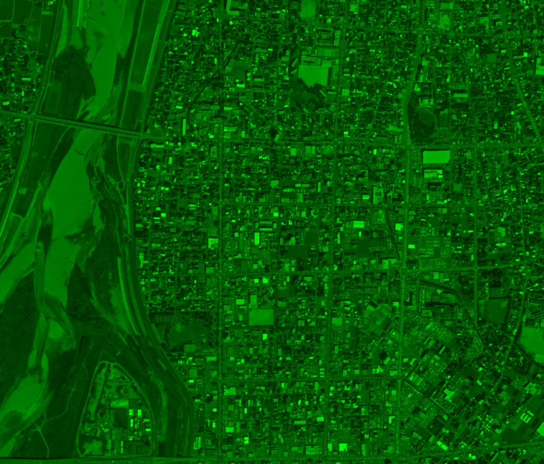
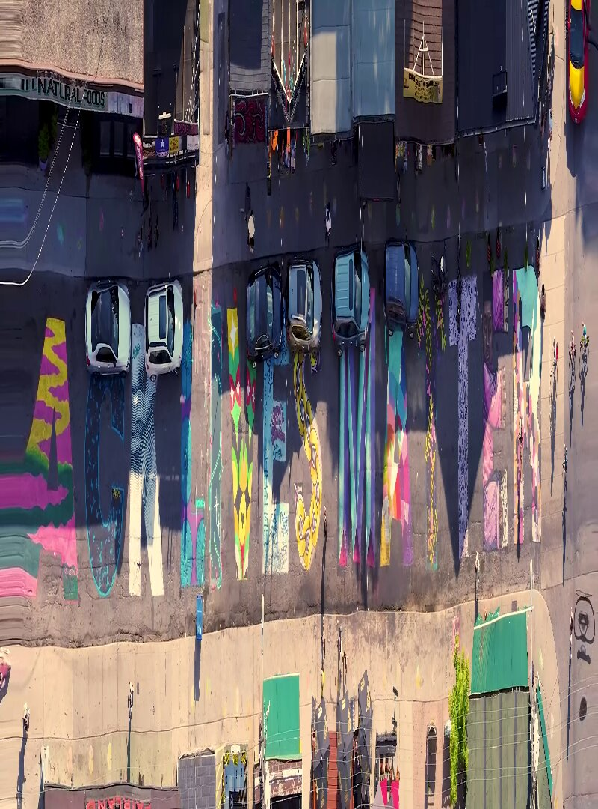
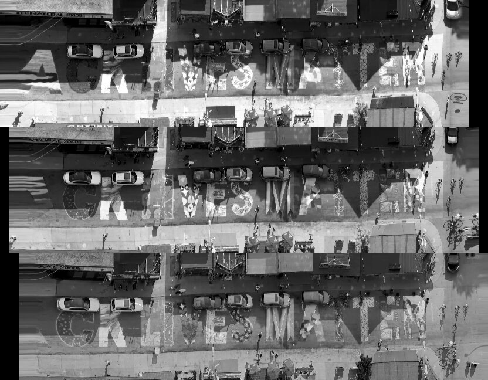
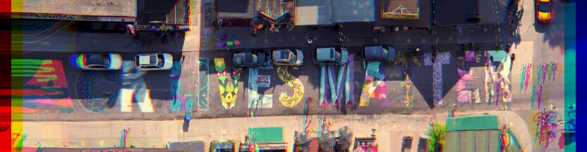

# Potato’s main features

This is the documentation for the techniques that are distinctive to Potato. Welcome to the fun part, if this is your idea of fun.

## Contents

1. Preface: beyond aspatial images
2. Main features
  1. No per-sample normalization
  2. All-band color conversion
  3. Band misalignment and psf injection
3. Appendix: minor techniques

# Preface: beyond aspatial images

An unlucky person could pursue an interest in image processing for years without ever being asked to question the idea that the universe of interesting photographs is basically those that can be scraped from the surface web. These images are typically side views of unknown places, lossily compressed, in some approximation of sRGB color space, up to a few megapixels; their processing pipelines can only be guessed at, but probably start with Bayer arrays. They are what [Fleischmann and Arribas-Bel](https://www.sciencedirect.com/science/article/pii/S0198971524000760) call _aspatial images_.

I am fond of many aspatial images and I hope to create and appreciate thousands more of them. They are technically interesting enough to fill dozens of lifetimes of research. But although they are important, their part of the space of all images is small. Thinking about the kind of high-end satellite imagery that we’re interested in here through the ideas we use for phone snapshots, and only those ideas, will lead to pitfalls and snares.

The techniques that follow are attempted revisions to some assumptions that hold for aspatial images but not for top-tier satellite imagery. They are ordered by increasing complexity: each of the sections is about 4× the length of the previous if you expand the optional asides.


# No per-sample normalization

_Taking advantage of physically meaningful inputs._

Our inputs are absolutely calibrated, meaning that a given data value (a digital number, or DN) has a defined mapping to a real-world value (a physical number, or PN). The DN inputs actually used for Potato, from the Maxar Open Data program, are `uint16` values that can be divided by 10,000 to give a PN in reflectance, in the range 0..1. The division is the DN to PN conversion.

A neural network will generally work best when inputs’ histograms resemble a standard normal distribution. Therefore, a common practice when working with ordinary images, which are auto-exposed and auto-whitebalanced, is to sample-normalize them by subtracting out each image’s mean and dividing out its standard deviation. This can be loosely thought of as enforcing an after-the-fact standard exposure and whitebalance.

Our images in reflectance have information in their absolute values. A very dark red thing, for example, is likely an entirely different material than a very light pink thing is, and that information should condition pansharpening. Therefore, Potato does no adaptive normalization: there is a global cube root operation to unskew the histograms, but no conditional scaling. (I do not claim that cube root, especially without an additive term, is near optimal. It’s in Potato primarily to show that global nonlinear normalization is not a problem, and secondarily to match the scaling in oklab.)

The space of calibration-preserving normalizations is sure to be worth exploring, and I commend it to the attention of the interested researcher. It may be, for example, that it is sensible to sample-normalize _if_ you pass the normalization coefficients into the network. Potato’s present setup is neither strongly principled nor carefully tuned, but it serves to make the floor-setting argument that a network its size, with techniques as simple as its are, can reach its output quality.

# All-band color conversion

_Taking advantage of multispectral inputs._

When creating an image from a sensor with red, green, and blue bands, a simple strategy is to copy their values (scaled in some way) into the red, green, and blue channels of an RGB color space. This approach rarely fails badly, but it’s suboptimal for any realistic pair of band and channel sets.

To get better color reproduction, we can start by seeing a multispectral sensor’s output as the input of a spectral power distribution estimator. (A spectral power distribution can be imagined as the readout of an ideal hyperspectral sensor with infinitesimal bands.) In more concrete terms: the WorldView-2/3 sensors have bands not only for blue, green, and red, but for deep blue, yellow, and the red edge, so let’s use them all.

We could go from band powers to XYZ color space (an abstract space used as a linking step for conversions), then to sRGB color space for display. In practice, Potato uses [oklab](https://bottosson.github.io/posts/oklab/) because its approximate perceptual uniformity works well with simple loss functions, and it’s easy enough to convert to sRGB for final output later.

The Potato network is a function from all bands’ reflectance values to the oklab color space. The conversion is learned; the “manual” work happens at data generation time. That process in overview is:

1. Generate many spectral power distributions, covering edge cases such as pure darkness.
2. For each SPD:
    1. Find the CIE XYZ color it induces.
    2. Find the band responses it induces.
    3. Create a color-matching pair consisting of band responses and XYZ colors.
3. Over all color-matching pairs, fit a matrix that converts band responses to XYZ.
4. For each data sample (i.e., multispectral image chip):
    1. Create an oklab image of the sample by applying the band→XYZ matrix, then the standard XYZ→oklab conversion.
    2. Create a training pair for the pansharpening model consisting of the band responses (the raw data) and that oklab image.

(Alert readers may notice slippage between the concepts of modeled reflectance and band power. This is handled by virtually illuminating reflectance values by D65.)

The color conversion is, I believe, a weak link in this project’s image chain. For example, instead of using only synthetic and mostly randomly generated SPDs, it would be better to include mixtures from a spectral library to ensure that the conversion is optimized for realistic SPDs. Also, the process models bands as monospectral in places; they should always be modeled as their documented response curves. And with some careful work, the conversion matrix could be created analytically, without needing optimization. (Then again, a nonlinear band→SPD→XYZ function _that includes the pan band_ might be an interesting avenue.) There are doubtless other shortcomings that I haven’t thought of. Nevertheless, warts and all, the color preprocessing appears to be an improvement on the naïve approach – and, as far as I have seen, not present in the literature, though I welcome correction.

To make a comparison of color conversion methods, we can run the demo script (using an image of Cianjur, West Java):

```sh
$ python docs/color_conversion_demo.py https://maxar-opendata.s3.amazonaws.com/events/Indonesia-Earthquake22/ard/48/300020121333/2022-01-04/10300100CB626A00-ms.tif naïve_color.tiff fancy_color.tiff
```

The images are too large to look at in full detail here, so we crop into the area around the [Cisarua Leather factory](https://cisarualeather.com/). Here it is with the bands-as-channels approach:

TK

_Keep in mind that no pansharpening is happening in either example image; in fact, the panchromatic band is not even present. Here we are looking at color conversions of multispectral bands only._

And with Potato’s all-band conversion:

TK

These are both lower-contrast than we’d generally want to see on a map. That’s acceptable (even desirable) at this stage in processing, but not ideal for comparison. There’s also a difference in color – the naïve version leaning red/purple, the fancy version leaning yellow/green – that’s interesting but outside our focus here. So for clarity, we’ll give them the same adaptive contrast stretch. Now adjusted, this is the bands-as-channels image:

TK

And the all-band image:

TK

There are subtle differences, but the big one is the violet v. blue roof color. The violet one, which I’m calling naïve, is the standard RGB bands to sRGB color space conversion. Please check my claim: for example, refer to any of the usual mapping services at latitude -6.843, longitude 107.14. A convenient way to see many examples is with the timeline tool in the desktop version of Google Earth. I counted about three dozen images in its history stack, credited both to Airbus and to Maxar, and they range from about halfway between these two examples to distinctly more violet than my naïve version:

_The 39 views that Google Earth has of this facility since its roof was put up. Imagery: Airbus and Maxar variously, via Google Earth._

To see the roof’s actual color, we can use [in-situ drone videos](https://www.youtube.com/watch?v=MLdckjstF3I#t=3m10s) or [Google’s own Street View product](https://maps.app.goo.gl/2Aqgzw1esr6JjH7k6). It is indeed blue, as we would expect that type of roof to be. The violet rendering is an artifact of shortcut color conversion.

The all-band method also incrementally improves the rendering of other surfaces, including red clay tile roofs, yellow objects in general, and many types of vegetation. However, the difference tends to be most obvious on deep blue materials, which standard imagery consistently makes overly purple (in other words, red-shifted). These are more or less foreseeable consequences of using the conventionally neglected information in the coastal blue, yellow, and red edge bands.


## Other advantages of all-band pansharpening

What we’ve seen above is not pansharpening – the example images were only from the multispectral bands, and were not sharpened by the panchromatic band. In principle, we could use the sRGB image made from all bands as input to a pansharpener that expects RGB channels-as-bands, and it would likely improve the output. However, there are reasons to think of pansharpening itself as a function of all available bands. Two of these reasons are noise and landcover classification:

_Noise._ There is little noise in this imagery. What remains, however, is remarkably difficult to characterize and mitigate. (For example, band misalignment is the topic of the whole next section.) If the bands were independent samples of the same underlying reality, we would have the square root law of denoising, and twice as many bands would give us a signal with only ~0.707 as much noise. Actually, the bands are neither independent (some kinds of noise correlate) nor sampling the same thing (by definition, they see different parts of the spectrum). Nevertheless, it’s reasonable to expect a well-trained model to cope better with – for example – an outlier signal in 1 band out of 8 than in 1 band out of 3.

_Classification._ Pansharpening should be conditioned on surface composition. As a simple example, imagine a big block of green next to a big block of brown, with some high-frequency detail but no clear boundary in the pan band. If the green surface has the spectral signature of artificial turf and the brown surface that of brick, the optimal pansharpening is probably a sharp edge. But if it’s live grass adjoining bare soil, the optimal pansharpening is probably an irregular gradient modulated by the small details in the pan band. (We might also imagine swirling v. bushy texture on something that could be algae or trees, or ripples v. corrugations on a surface that’s either a pond or a roof.)

To turn this point around, pansharpening is not merely the guided upsampling of abstract shapes. What’s in the pictures matters. It’s easier to tell what’s in the pictures with all the bands.


# Point spread functions and band misalignment

_Accounting for sensor-type–specific artifacts._

Imagine an ideal multispectral digital sensor’s output. Each pixel in each band represents a perfect integration of incident light over a given segment of spectrum, over a given square of the image plane, without gaps. The data we’re working with comes remarkably close to this ideal. (Especially when compared to raw photos from cameras with Bayer arrays.) But it is, of course, not perfect.

## Point spread functions

The data we’re considering tends to be slightly oversharp, meaning the point spread function has small negative lobes, and we see [ringing artifacts](https://en.wikipedia.org/wiki/Ringing_artifacts) around very high contrast edges. <!-- This is the source of the “dark halo” effect in the LGTEUN image in the first example. --> The severity of the effect varies between sensors, between images, within images, and directionally, for guessable but undocumented reasons. In Potato it’s addressed by injecting sampling jitter, which is easiest to describe as part of:

## Band misalignment

Band misalignment is also called, for example, band-to-band mis-registration (BBMR).

<details><summary>Lengthy (2,500 word), optional sidebar on the causes of band misalignment</summary>

_The following contains both severe simplifications and technical detail. It also makes guesses about proprietary aspects of satellites’ designs. I welcome corrections that are sourced to reliable public information._

A general observation about image sensors is that it’s impossible to collect a full range of colors, over a whole field of view, in one instant, at high quality. Our eyes do not do this; film cameras, despite the occasional claims of their most committed fans, don’t either; and neither do $10 billion space telescopes. The fuzzy part of the claim is “high quality”. A more engineering-minded description is that there is always some tradeoff among the resolution of wavelength, of angle, and of time. Consumer cameras, for example, give up angle: by using Bayer arrays, they do not actually collect everything in the frame.

The imagery we’re interested in here is collected by [pushbroom sensors](https://natural-resources.canada.ca/maps-tools-and-publications/satellite-imagery-elevation-data-and-air-photos/tutorial-fundamentals-remote-sensing/satellites-and-sensors/multispectral-scanning/9337). These rely on the motion of the satellite’s orbit to sweep smoothly across Earth. They give up time: instead of collecting whole frames, they collect only a single line of pixels per band, and these are stacked into 2D records where one dimension is extent in space and the other is extent in both space _and_ time. Imagine a photograph where each row of pixels is from a millisecond after the one above it. (In fact many ordinary photographs are constructed in a loosely analogous way, so don’t push your imagination too hard.)

In the optical system of the satellite, light from a single line of Earth’s surface (ignoring things like clouds for the moment) is diffracted into a spectrum, reasonably similar to the one cast by an ordinary prism. It can be imagined as looking like this, where the white line moving across the center of the scene on the right is being diffracted – split by wavelength – into the spectrum on the left:

[](https://www.youtube.com/watch?v=y7KLyO2zXi4)

_Click through to video. This is a simplified visualization of a line of an image being projected to a spectrum. Play fullscreen for greatest clarity, and see main text for notes. Source data: © Maxar, CC BY-NC._

The spectrum is two-dimensional on the plane. Its _y_ axis (up and down) is the same as _y_ in the scene space, or distance on the white line. In other words, as the white line crosses something, we can look directly to its left and see that thing’s spectrum aligned with it. In the scene’s space, the _x_ axis is also physical space, but in the spectrum, _x_ is wavelength, from indigo to red. If we place light sensors in strips along colors in the spectrum, each strip can measure a different band of wavelengths. These are the bands we’re talking about in multispectral imagery.

Imagine that we recorded a vertical line through the green part of the spectrum over time. Instead of playing it back in time, as an extremely narrow animation, we could lay it out in space, as a 2D image. This is a <a href="https://paulbourke.net/miscellaneous/slitscan/">slitscan</a>: a rotation of a row of video pixels from _x_, _t_ space (a line seen over time) to _x_, _y_ space (a flat image). If we imagine a video as a 3D solid of pixels that we are seeing many slices of each second, a slitscan means to slice through successive planes of pixels in either of the other directions: video from the side, so to speak. Here’s what a slitscan of the 480th column of the video looks like, rotating it from extending in _y_ and _t_ into extending in _y_ and _x_:



(I’m using <a href="https://gist.github.com/celoyd/cd0a827b17eb7e75d2451bc677229d63">this script</a>; it should be reasonably straightforward to replicate. Your results may show artifacts from video compression. Also note that, as usual in this documentation where absolute characteristics are not in question, I am resizing, color-balancing, etc., for your clarity and my convenience.)

This rotation around dimensions is exactly equivalent to what the satellites are doing. Putting aside many complicated details, looking narrowly at the fundamental concepts, this is how a green band is recorded. The bands of pushbroom satellites are slitscanners.

A practical problem in satellite optics design is that it’s hard to get all the information out of a single spectrum. For example, we want a panchromatic band that detects more or less all visible light (meaning it’s as wide as the whole spectrum), but also multispectral bands that only collect subsets. Overlapping them would require splitting the spectral light, adding complexity and noise. Also, bands are easier to engineer if they have space on at least one side, for ease of wiring.

Therefore, imaging satellites typically cast multiple spectra, each onto its own detector sub-array. To do this without dividing the light among spectra, each spectrum must draw from a different strip of light from Earth – a different line, as visualized in the video. We can imagine three parallel lines on the scene as it scrolls, casting three spectra onto three sub-arrays. But a problem arises: the problem that we are here to understand.

Let’s explore this multi-line arrangement in a more familiar and easier-to-demonstrate context. To do that, we need a video. Our proxy for a satellite’s view will be <a href="https://commons.wikimedia.org/wiki/File:Giant_BLM_street_sign_in_Kensington_Market_-_Black_Lives_Matter_-_Street_Art_Paint_Painted_Sign_-_Drone_video_DJI_Mavic_Mini_-_Flying_Left_to_Right_-_Friday_July_3,_2020_-_5-25pm_-_Creative_Commons_Attribution.webm">this clip by Jason Hargrove</a> (<a href="https://creativecommons.org/licenses/by/2.0/deed.en">CC BY</a>), because it’s a nadir-pointing view, in relatively smooth motion, of a scene with some depth and internal motion, and it’s openly licensed. Please watch the video with a spatiotemporally critical eye. If we slitscan its 1000th column (about halfway along: it’s 1920 pixels wide), we get this:



This is made with <a href="https://gist.github.com/celoyd/cd0a827b17eb7e75d2451bc677229d63">the same script</a>, run like so:

```sh
python slitscan.py frames c1000 c1000.png
```

If we look at this as an attempt at an accurate map, instead of as an off-label use of a video meant as a video, it has many shortcomings. One is its aspect ratio. The _y_ dimension (up and down on the screen) and the _x_ dimension have different scales. To make it roughly conformal, we will arbitrarily squeeze the image, here using ImageMagick’s `convert` utility:

```sh
convert -filter Box -resize 100%x20% c1000.png c1000-flat.png
```


We can see, for example, the “torn” letter A. This is from the beginning of the video, before the drone is in motion. In a slitscan, the more time something spends intersecting the column we’ve selected, the longer it is in the resulting image. And indeed the cyclists near the right edge, who were riding against the drone’s direction of motion and thus intersected the column only very briefly, are compressed.

Now we have built the principles and intuitions to see what we came to see. Here we slitscan the frames of the video on three different columns, separated by 100 pixels:


```sh
# we actually already did the first one, but let’s leave it for clarity
$ python slitscan.py frames c1000 c1000.png
$ python slitscan.py frames c1100 c1100.png
$ python slitscan.py frames c1200 c1200.png
```

These are records of a line across the track direction at three slightly different angles in the along-track direction. Compared:

```
$ montage -mode concatenate -filter Box -resize 100%x20% -tile 1x c1{0,1,2}00.png comparison.png
```


The images are offset, which we are about to correct, and other differences will become more obvious. To more clearly emulate the satellite’s setup, let’s look at only one band (or channel) per slitscan – imagining that each one is a different detector sub-array. Also, we can measure the _x_ axis offset between bands, using the left foot of the M as a reference, at about 16 pixels, so we can align them by placing them in a slightly wider image (using [gravity](https://www.rubblewebs.co.uk/imagemagick/notes/gravity.php)).

```
$ convert -size 832x1080 xc:black \( c1000.png -channel R -separate \) -gravity west -composite -filter triangle -resize 100%x20% red_l1.png
$ convert -size 832x1080 xc:black \( c1100.png -channel G -separate \) -gravity center -composite -filter triangle -resize 100%x20% green_l1.png
$ convert -size 832x1080 xc:black \( c1200.png -channel B -separate \) -gravity east -composite -filter triangle -resize 100%x20% blue_l1.png

$ montage -mode concatenate -tile 1x {red,green,blue}_l1.png band-comparison.png
```



Merged into an RGB image:

```sh
$ convert {red,green,blue}_l1.png -combine rgb_l1.png
```



Here we have recreated band misalignment. Without a platform as smoothly moving as a satellite, we have some artifacts due to sensor acceleration alone: the torn letters at the left margin, where the drone was just starting it pass. <!-- Just as the lack of real motion (of cars, for example) in the animation above was a limitation of its source data, the unstable perspective is an artifact of this data. --> But other features have close analogs that appear in the pushbroom satellite imagery that this project is about. We will consider motion offset, then height offset.

Motion offset follows immediately from the sensor’s entangling of angle and time. Because different bands see the same point in space at slightly different points in time, the colors of anything in motion are seen in different places. In the image we made from the drone video, we see this on pedestrians and cyclists. In many satellite images, it’s most noticeable on cars on highways. From a typical very high resolution satellite, we might see a (red, green, blue) car at _t_ = 0 seconds, _x_ = 0 meters, θ = 0 mrad; then a panchromatic car at _t_ = 0.15 s, _x_ = 3 m, θ = 1.25 mrad; then a (red edge, yellow, coastal blue) car at _t_ = 0.3 s, 6 m, 2.5 mrad. (These numbers are approximations of WorldView-2’s parameters as worked out by [Kääb (2011)](https://www.mn.uio.no/geo/english/people/aca/geohyd/kaeaeb/kaeaeb/kaab_ieee_grss_fusion_2011.pdf) and [Krauß (2014)](https://www.researchgate.net/publication/280744253_Exploiting_Satellite_Focal_Plane_Geometry_for_Automatic_Extraction_of_Traffic_Flow_from_Single_Optical_Satellite_Imagery). Both papers are worth reading if you’re interested in this topic, and both have helpful illustrations beyond what I have attempted here.)

Motion offset is a complicated topic, but once we know how these sensors work, its _cause_ is nice and straightforward: different color components of an image are recorded at slightly different times.

To think about height offset, consider the 16 pixel shift we applied to the R, G, and B images from the drone. That distance came from measuring the offset between raw bands using a fixed point on the ground. Each horizontal pixel is one frame in the video, and the video has 30 frames per second, so we know the time offset of the bands was 16/30 ≈ 0.533 seconds. More accurately, we know that the time offset of the bands _at that point_ was about 0.533 s. Even if the drone’s point of view were a perfect linear translation, and even if there were no real-world motion within the scene, not all points would appear to move at the same speed relative to the video frame. The scene varies in height. Therefore, in the image space – in other words, as measured in pixels – the roofs of buildings are moving faster because they’re closer to the sensor.

This is parallax, an aspect of perspective so familiar to sighted people that it can be hard to think about abstractly. If we shift our heads from side to side while looking forward, closer things have more _apparent_ motion – they move more in image space. This is so useful that we have evolved a way to see from two horizontally separated places at once without having to move our heads, and to fuse these two images into a subjectively mostly unitary experience.

The equivalent of this fusion is terrain correction, a difficult problem in satellite image processing. We can find the latitude and longitude of each pixel in each band by working backwards from the satellite’s position, the pixel’s angle, and an elevation map of Earth. Conceptually, we are projecting the image from a virtual satellite back at a blank 3D model of Earth and seeing where each pixel falls. Then we warp the image to a standard projection by smoothly pushing and pulling each pixel from where it sits in the raw image to the projection of the coordinates of the point it landed on in the 3D model.

But all this can only be as good as the 3D model is – and 3D models are rarely great. Away from the parts of the world with lidar surveys and the like, the best available data is things like [SRTM](https://www.usgs.gov/centers/eros/science/usgs-eros-archive-digital-elevation-shuttle-radar-topography-mission-srtm-1) and [ASTGTM](https://lpdaac.usgs.gov/products/astgtmv003/), both of which have only ~30 m resolution and are never as up to date as one would want. We can see traces of this problem in almost any imagery that’s terrain-corrected (without which it’s more or less useless for mapping). It’s especially clear where we find lines that we know should be straight in the real world, and that stand on or over rugged ground that has changed since the terrain data was updated. New airports are a good place to look for this:

TK, TK

_Istanbul Airport (IST)’s runway 36/18, completed June 2020, as shown for two dates in Google Earth. The terrain scale is set to the minimum and the view is from directly overhead, so display-layer warping should be virtually zero; we’re seeing something close to the 2D source data. How do we know that the markings are straight in reality? Among other things, we know that international aviation regulations require runway edge markings to be very straight, and we can watch <a href="https://www.youtube.com/watch?v=H5uHy5p2Ucs#t=4m30s">videos</a> <a href="https://www.youtube.com/watch?v=DjHUHPUS33o#t=23m30s">by</a> <a href="https://www.youtube.com/watch?v=qL3KOv0cjBI#t=14m45s">pilots</a> showing lines that appear perfect to the limits of distortion in the cockpit windows and the camera lens system. More interestingly, the wiggles are roughly opposite between the two images, suggesting that they’re processed against similar terrain models – using data from before the landscape was graded for the runway – as seen from roughly opposite angles._

So the shortcomings of terrain models cause problems, but there’s a deeper issue. We don’t exactly want terrain models. Earth’s _terrain_ surface is not really what we’re mostly seeing in visible-light images of “land”. We’re mostly seeing grass, trees, and buildings. If the angle between WorldView-2’s first and last bands is 3e-3 radians, and the bands are aligned at the ground surface, then, by [the small-angle approximation](https://en.wikipedia.org/wiki/Small-angle_approximation), a tall building of 300 meters has an offset at its top equivalent to 3e-3 × 3e2 = 0.9 meters. This amounts to a very short-baseline stereo pair being treated as a single image. As with any stereo pair, for views of complex 3D subjects there is no _trivial_ way of fusing the images. <!-- The primary visual cortex in humans has about 140 million neurons. -->

So why not use a surface (or “canopy”) model instead of a terrain model? That is, if it’s a problem for the visible surfaces of things to be above the ground we’re modeling, why not model the visible surfaces? Two reasons. First, the available data is even worse. No one has a reliable, realtime map of the shape of every building and tree and bunch of grass in the world at any scale. Second, the modeling is very difficult. Canopies have more discontinuities at the 0.1 to 10 m scale than ground surfaces do. (This is why we can’t align by cross-correlation alone. The warp map would be full of jumps.) Imagine trying to project an image of a radio tower onto a 3D model of it. Even given miraculous perfection in all other aspects, the wind making it sway a little would be enough to pull everything out of alignment. And what would we use to fill data in band A that was only seen by band B?

Clouds are another example. They are often high above the ground,<sup>[citation needed]</sup> and they are notoriously transient. There is likely no more precise source of truth for what a given cloud looked like at a given moment than the image we have. If we imagine trying to correctly place the cloud above the longtiude and latitude where it actually was (filling the now-exposed Earth surface pixels with what?), that’s only a more extreme version of trying to reconcile the three slightly different images of a tall building. Or consider the artist James Bridle’s [rainbow planes](https://www.youtube.com/watch?app=desktop&v=eD8r9LjcwAc) – aircraft present most of the challenges of clouds plus high speed.

Thank you for attending this sidebar on the causes of band misalignment.

</details>

To see band misalignment caused both by height and by motion, let’s look at an image of tall buildings by a highway. We’ll use [the Bahria Icon Tower](https://en.wikipedia.org/wiki/Bahria_Icon_Tower), in Karachi. (I’ll be resampling and brightening these images arbitrarily for clarity of visualization.)

In the panchromatic band:

TK

In the R, G, and B bands:

TK

In the deep blue, yellow, and red edge bands, mapped to RGB:

TK

<details><summary>Animation cycling at ~3 Hz (possible epilepsy trigger and definite annoyance)</summary>

TK

_Alternating between the red and yellow bands every 0.3 seconds, roughly their actual difference in time – note the plausible speed of the cars._

</details>

We can derive a warp map (offset field) from the yellow to the red band, with angle as color and saturation as magnitude. This is with [a good optical flow algorithm](https://scikit-image.org/docs/stable/api/skimage.registration.html#skimage.registration.optical_flow_ilk) but shows big problems, for example with the reflections off the south face of the towers:

TK

With the all-band color conversion described above:

TK

Zoomed in on the area of most height offset:

TK

We would probably find a wide range of reactions to this artifact among different people doing their different things with imagery. For some, it would be unimportant; for a few, it might be a severe problem; for most, probably, it would be a small problem. If it is a problem, it has no perfect solution. (For several reasons, but as a backstop argument, because there are parts of Earth’s surface that some bands saw but others didn’t: the information simply isn’t there to be recovered.) Therefore, for those of us who want to pansharpen, there are many reasonable but incomplete approaches to it.

One strategy for band misalignment is to ignore it. This is the approach taken by most pansharpening research. Where the goal is to explore some limited aspect of pansharpening, this may be justified, but it will not work for real-world applications. It will, in fact, tend to _magnify_ artifacts.

<details id="Wald"><summary>Sidebar on Wald’s protocol and associated scale problems (for the pansharpening superfans)</summary>

_Here, resolution and sampling are given in terms of 1D length, not 2D area: for example, resampling a 10×10 grid to a 5×5 grid would be called 2× downsampling. Also, for simplicity, we assume that the pan:multispectral resolution ratio is 4:1; this holds for the data used in this project (WorldView-2/3), and most comparable data (e.g., Pléiades Neo), but not for all pansharpenable imagery (e.g., SkySat, Landsat 8/9)._

Consider the problem of notation for pansharpening: we want to express ideas like “the multispectral bands 2× upsampled as conditioned on the panchromatic band 2× downsampled” in clear and compact forms. This has apparently never been done in a really elegant way, and, in the spirit of [XKCD 927](https://xkcd.com/927/), will be inelegant here too. We will use symbols on the pattern _B↕_, where _B_ is P, meaning the original pan band; M, the original multispectral bands, or V, visible imagery; and ↕ is a sequence of ↑ and ↓, representing up- and down-sampling by 2×. For example, pansharpening is in some places defined as M↑↑ (multispectral bands at the resolution of the pan band) but in other places, including Potato, it’s V↑↑. This notation does not try to show all useful facts, for example where upsampling is conditioned on other information. The thing to remember is that P and M↑↑ have the same resolution.

A problem upstream of many other problems in pansharpening research is a lack of full-scale training data. Pansharpening is an extrapolation of imagery’s spatial resolution, and we have virtually no ground truth at the scale that we want to extrapolate _to_. The ideal training data would be hyperspectral, to match band responses, and with a ground sample distance finer than about half the real data’s, to allow for sampling artifact injection – and it would be plentiful and cover a wide range of landcovers. This is simply not available. A widespread workaround is called Wald’s protocol (from [Wald et alia (1997)](https://www.asprs.org/wp-content/uploads/pers/1997journal/jun/1997_jun_691-699.pdf), despite that paper citing earlier work). It downsamples full-resolution data into P↓↓ and M↓↓, so that the function being modeled is (P↓↓, M↓↓) → M. This approximates, and is applied as, (P, M) → M↑↑.

It’s not a perfect approximation because M↓↓ does not look exactly like M. Of course it doesn’t for any _specific_ M, but also in general: if I give you an interesting satellite image, you can do far better than chance at guessing its scale. And pansharpening should depend on scale. If we could poll everyone who thinks about these things, I think we would find disagreement about the degree to which this holds, but I would be toward the “more” side. Some examples of plausible scale-dependence in a deep learning–based pansharpener:

- We should expect a model seeing a patch of green surrounded by a fallow field to decide whether it is a relatively soft-edged patch of grass or a relatively sharp-edged tree canopy in part by having an assumption about the typical size (in pixels) of a tree.

- Most objects that the model will see in training that are moving quickly will be cars. Objects in motion must be treated specially. There are other artifacts, and conceivably even real features, that might appear similar to motion artifacts, and the model is likely to use information on whether the feature is car-like to help resolve ambiguity. But cars have a characteristic size range. A model trained on (P↓↓, M↓↓) but applied on (P, M) will have false-negative failures to apply car logic to real cars. It might even have false positives where cosmic rays, birds, etc., incorrectly trigger car rendering rules.

- Band misalignment, an error measurable in length, is necessarily scale-dependent. Suppose that the standard deviation of all-cause band misalignment is 0.1 pixel in M. It will then be 0.025 px in M↓↓. Therefore, training on (P↓↓, M↓↓) → M is training to quadruple misalignment artifacts – to find them and scale them up. Inference on (P, M) → M↑↑ will then presumably result in final imagery with a standard deviation of band misalignment of 0.4 px. (A similar argument is available for point spread functions.) Naïvely feeding the model source data that has had artifacts reduced by downsampling, paired with target data with real artifacts, is teaching artifact magnification exactly as much as it’s teaching feature magnification.

The first of these examples would hold even for pansharpening ideally sampled data of real scenes, the third would hold even for real images of completely artificial test patterns, and the second concerns both real features and real sensors.

The argument here is not against Wald’s protocol but for careful contemplation of its consequences. The paper that popularized it is a key contribution to the painfully sparse theorization of pansharpening; it is arguably the closest thing we have to a foundational text for conceptualizing what this is all about. The rarity of that kind of work is a shame for the field, which may be small but still deserves a serious theoretical literature. Without serious conversations about what we’re doing, how we’re doing it, and what our results mean, pansharpening as applied and pansharpening as researched have diverged into two half-fields. The dysfunction is not absolute, but it is serious; probably about half the people taking pansharpening seriously are authors on [a single paper](https://ieeexplore.ieee.org/document/9844267). Mostly, on the research side we find deep learning techniques that proceed from the assumptions of aspatial imagery and fail severely on real data. On the applied side, equally partial in its grasp on what’s actually important and interesting in pansharpening, we have:

</details>

Another strategy, used by classical methods like those seen in Maxar’s in-house pansharpening and on Google Earth – as far as I can interpret them without documentation – is to (1) use only the RGB bands, since they’re aligned with each other (presumably by design), thereby cutting the problem roughly in half, and (2) low-pass them. In Google Earth we generally see a “rainbow” only either leading or following moving objects, not both. The rainbow is distinctly blurry.

<!-- https://pubs.usgs.gov/of/2021/1030/p/ofr20211030p.pdf -->

Potato tries a third strategy. It comes in part from using all-band color conversion, which basically doubles the color artifacts: they will appear on both sides of a moving (or tall, or otherwise off–terrain-model) object. This makes them too obvious to ignore. It’s also a response to the promises and limits of deep learning, which is able to address some remarkably complex nonlinear problems, but only if they’ve first been framed carefully. The approach is to inject band misalignments into the source side of the training pairs. In other words, we try to teach the model to undo band misalignment. Here’s how that works, to a moderate level of detail. Given an image chip of size 8×h×w, for example:

TK

We create a 2×h×w offset field of low-frequency noise that’s zero at the edges (to avoid trying to move pixels across them). One of its “channels” can be visualized like this:

TK

Then we warp the image by the offsets (i.e., using the channels as _x_ and _y_ motion vectors) – the front band sub-array offset positively and the back bands negatively. (The polarity doesn’t matter since it’s a 0-centered random field. We’d like the model to be able to correct misalignment in any orientation anyway.) In other words, the field is used to set the direction and amount of band group splitting. The image now looks like this:

TK

We also inject sampling noise by doing this twice with different warp interpolation methods. For example, the previous image showed warping with bilinear interpolation, but if we extrapolate from that toward the same inputs warped with bicubic interpolation, then keep going further, we get this “hyper-bicubic” version:

TK

So we sample the space of {inter,extra}polation around these methods of interpolation. This is intended to jitter the point spread function in the range from oversoft to oversharp. Ideally, we would use a more sophisticated space of psfs, and observe other niceties such as applying them to the whole image instead of rolling them off with the offset. Such improvements are worth considering, but in practice, the simpler method appears adaptable and robust so far.

In all of this, the panchromatic band’s data is untouched. The goal is for the model to learn to use it as the reference.

<!-- TK TK A shortcoming is that the model does not learn to account for variation in the panchromatic band’s psf. -->

In my opinion, band misalignment is the only part of the problem of pansharpening that practically needs deep learning to reach current state-of-the-art results.

## Appendix: Minor techniques

_Technical notes that might help others._

**Oklab.** The oklab color space is approximately perceptually uniform, so Potato uses a color loss term that is simply Euclidean distance within it. This is a more correct version of the mean absolute error of (implicitly sRGB) color values that many image processing models use. It’s still not a perfect ΔE – oklab has its quirks – but it’s very close for small differences.

**Using the Maxar Open Data repository.** This is, so far as I know, the largest assembly of highest-resolution satellite data that has ever been openly available. Its landcover distribution is not exactly what a researcher might request, but it’s good. Training on this repository rather than on a few scenes is an enormous advantage. Naturally its license entails some constraints, but for those of us interested in the problem in itself, it’s an amazing resource. (Those with a practical need for pansharpening have their own data to use, I assume.)

**Double downsampling.** Potato trains on, in the notation from the Wald sidebar, (P↓↓↓↓, M↓↓↓↓) → V↓↓. This is a dependence on lots of training data. It means the model sees data that is even more removed from the inference (real) scale than it would with singlefold Wald, which is a serious disadvantage. I believe the model materially suffers from a lack of examples of, for example, large non-water blue objects. On the other hand, it makes for much cleaner target data.

**Avoiding clouds.** To avoid showing the model target imagery with offsets as large as those seen on clouds, even with double-downsampling, I filtered inputs to only completely clear ones. (And one of Nairobi with a bit of cloud – [104001008E063C00](https://radiantearth.github.io/stac-browser/#/external/maxar-opendata.s3.dualstack.us-west-2.amazonaws.com/events/Kenya-Flooding-May24/ard/acquisition_collections/104001008E063C00_collection.json?.language=en) – because it was too beautiful.)

**Mixing WorldView-2 and WorldView-3 data.** Many pansharpening approaches that seem pretty unrigorous nevertheless conscientiously treat WV-{2,3} as independent systems that need separate models. However, open documentation – [_Radiometric Use of WorldView-2_](https://dg-cms-uploads-production.s3.amazonaws.com/uploads/document/file/104/Radiometric_Use_of_WorldView-2_Imagery.pdf) and [_Radiometric Use of WorldView-3_](https://dg-cms-uploads-production.s3.amazonaws.com/uploads/document/file/207/Radiometric_Use_of_WorldView-3_v2.pdf) – shows them as functionally identical in virtually all ways relevant to pansharpening. The difference between them is unlikely to be one of the largest parts of any plausible error budget. (As a backstop argument, if they _do_ have noticeable differences, we would expect a good model to notice them and be bimodal.)

**No sharpness bias.** People developing pansharpening techniques like to show that their work produces sharp outputs. But a slightly undersharp image and a slightly oversharp image are about equally useful; it’s easy to turn one into the other with very little loss. Problems arise when they are _very_ under- or over-sharp, which start to destroy amounts of information that will actually matter to users. The sensible aim point is images as sharp as the world is. Users who prefer slight oversharpness, for example, can apply an unsharp mask or similar. There is certainly more to this from a signal processing perspective, but I don’t think it changes the practical analysis.
