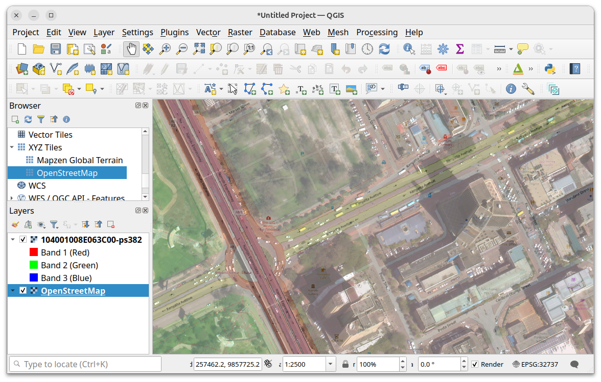
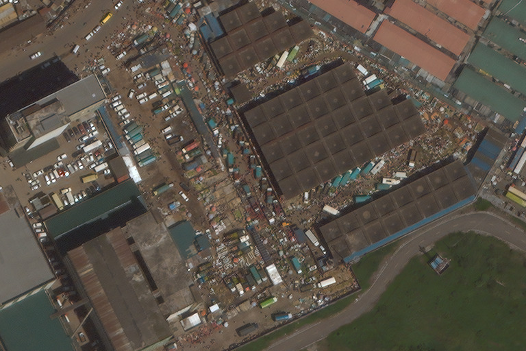
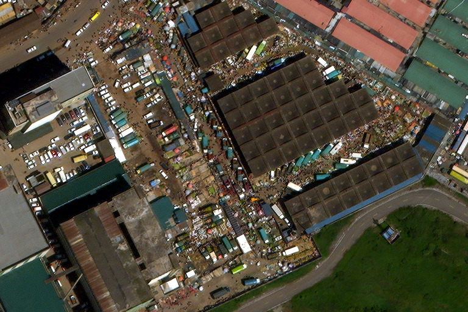

# Quickstart

This quickstart shows how to set up a python environment for Potato and then:

1. pansharpen real imagery with Potato or
2. prepare and run a training session with Potato

with the focus on getting results as quickly as possible without skipping any crucial ideas.

## Preliminaries: python environment setup and device selection

### Python environment setup

The following works on a recent Ubuntu system with [uv](https://github.com/astral-sh/uv). Readers who prefer some other way of doing things (e.g., regular pip/virtualenv on macOS, or conda on NetBSD) are entrusted to make the translations. All that matters is that we have an environment with `python 3.12` (used for development – others may actually work) and the packages in the requirements file.

```bash

# create a new virtual environment
uv venv --python 3.12

# enter it
source .venv/bin/activate

# populate it
uv pip sync requirements.txt
```

### Finding a device

Decide which hardware [backend](https://pytorch.org/docs/stable/backends.html) to run the model on. The safest choice is `cpu`: the model will run on the main processor. This works on any machine but is slow. For hardware acceleration, figure out the brand of the best GPU on your machine. If it’s AMD or Nvidia, use the `cuda` backend. If it’s Apple, use `mps`. Beyond that, you will have to figure it out yourself. If you have multiple GPUs, you may want something like `cuda:1`. If you get stuck, `cpu` is enough for testing (but not training, unless you’re extraordinarily patient).

The device selection is something you remember and use as a flag, not a global configuration option. This is to help you mix devices. I often want to test while I’m training, but training intentionally maxes out the GPU’s memory, so at these times I test on the CPU.

This quickstart will use `cuda`, my best option, so when you see it, think of it as a variable to be replaced with yours.

## Pansharpening

Here we will combine a panchromatic image and a multispectral image to make an RGB image.

### Download pansharpening inputs

To find sample input data, I went to [the Maxar Open Data Program landing page](https://registry.opendata.aws/maxar-open-data/), clicked the STAC Browser link, and navigated among many other good choices to [here](https://stacindex.org/catalogs/maxar-open-data-catalog-ard-format#/item/aCtvMLE92XskBWQbvt9J3vsA7EgRSdJ15SD3LJA6JS6f5SAxD/4dKymbGqAdScTepcQsBdACXvFvWipUToM2xs4gbaKtavizTRjBNSoaWKYELhidUbN2hF3DhyD1jwqeqhcZs1BuxpzChBDkqEB43meyRhi4D3YSy/5utsGWgkk8Rmyft4fhmmxhnoUPK96JjztCbzDmqpoMsS34t1fsuwh3R85msyGVfHd1fYvjV5yChWzjUf6mvpqnzhsFxT1Ws3iAcu?si=2#13/-1.288302/36.820695), which shows direct TIFF links in the Assets section. We need the panchromatic and multispectral images. (We could in principle do everything directly off the network, but for clarity, here we’ll actually download the files.)

<details>
  <summary>Sidebar: using other data</summary>

Potato expects data that looks like WorldView-2 or -3 bands in Maxar’s ARD format. The images are pixel-aligned at a factor of 4 (not simply both georeferenced), the multispectral image has 8 bands as documented for the WV-{2,3} sensor, and the DNs are reflectance, mapped from 0..1 to 1..10,000 in `uint16`. Anything with _approximately_ those spectral bands, where the values are _approximately_ 10k reflectance, is likely to _approximately_ work. But the design input for the model (with the weights shipped in this repo) is ARD.
</details>

We use a {} expansion to make this slightly more legible with the long and very similar URIs:

```bash
curl -O "https://maxar-opendata.s3.amazonaws.com/events/Kenya-Flooding-May24/ard/37/211111023311/2023-11-30/104001008E063C00-{pan,ms}.tif"
```

We now have the two TIFF files:

```console
user@host:~/potato $ du -h 104001008E063C00-*
295M  104001008E063C00-ms.tif
561M  104001008E063C00-pan.tif
```

### Pansharpening

Let’s go for it:

```bash
python demo.py --device=cuda 104001008E063C00-{pan,ms}.tif -w sessions/bintje/377-gen.pt 104001008E063C00-ps.tiff
```

We should see either some kind of reasonably helpful error or a progress bar. On my 1070 (a GPU released in 2016), it takes 26 seconds; on my CPU alone (i.e., with `--device=cpu`), it takes about 5 minutes. We now and have a big, pansharpened output file:

```console
user@host:~/potato $ du -h 104001008E063C00-ps.tiff
1.4G  104001008E063C00-ps.tiff
```

This is a reasonably ordinary RGB TIFF and should be readable by image libraries, photo editing software, and so on. (It does use zstd compression, which is still considered “the new one”, but libtiff has supported it [since 2018](http://libtiff.maptools.org/v4.0.10.html) and it’s really good. If necessary, replace `zstd` with `deflate` in the `demo.py` line that reads `"compress": "zstd",`.)

Output is relatively low-contrast. This is intentional. In short, it makes it easier to represent extreme colors correctly if we keep most colors near the middle of the range. Just turn the contrast up.

It’s also a geotiff, meaning it’s in a defined projection. This allows for a wide range of interesting experiments (and, of course, the sort of work you would do to use the imagery seriously to construct a web or static map). For example, it can be reprojected, matched to other geotiffs (such as the default pansharpening, at the same address but ending in `-visual.tif`), and mixed with other data in tools like QGIS:



_Pansharpened image translucently overlaid on [OSM](https://www.openstreetmap.org) (© [OpenStreetMap contributors](https://www.openstreetmap.org/copyright)). This is confusing and unpleasant, yet possible and accurate._

The main cost of being a geotiff is that some cautious non-geospatial tools will complain about the geotags. This should be harmless. For example, if we use the [ImageMagick](https://imagemagick.org/index.php) tool `convert` to crop out a section, we get warnings:

```console
user@host:~/potato $ convert 104001008E063C00-ps.tiff -crop 768x512+12000+8000 Wakulima-market.png
convert-im6.q16: Unknown field with tag 33550 (0x830e) encountered. `TIFFReadDirectory' @ warning/tiff.c/TIFFWarnings/905.
convert-im6.q16: Unknown field with tag 33922 (0x8482) encountered. `TIFFReadDirectory' @ warning/tiff.c/TIFFWarnings/905.
convert-im6.q16: Unknown field with tag 34735 (0x87af) encountered. `TIFFReadDirectory' @ warning/tiff.c/TIFFWarnings/905.
convert-im6.q16: Unknown field with tag 34737 (0x87b1) encountered. `TIFFReadDirectory' @ warning/tiff.c/TIFFWarnings/905.
convert-im6.q16: Unknown field with tag 42113 (0xa481) encountered. `TIFFReadDirectory' @ warning/tiff.c/TIFFWarnings/905.
```

These are safely ignored, and we get the image we should:



If we add some contrast with `convert`, for example with a channelwise auto-level:

```bash
convert Wakulima-market.png -channel R,G,B -normalize +channel Wakulima-market-contrast.png
```

We get a nicer image:



And that’s the pansharpening demo. To familiarize yourself with the process a little more, you might try it on other images from the Maxar Open Data Program, and you might try postprocessing the outputs a little further (with some gamma, for example).


## Training quickstart

Training itself is done with `train.py`, but setting up the data for it to use is a relatively involved process, called chipping, which takes up most of this tutorial.

We will use [`aws-cli`](https://github.com/aws/aws-cli). In principle it’s all possible using the HTTPS API endpoints, but `aws s3 sync` makes things simpler.

### Source data and directory setup

Here we will use [the Maxar Open Data Program’s imagery for the Emilia-Romagna flooding of 2023](https://radiantearth.github.io/stac-browser/#/external/maxar-opendata.s3.dualstack.us-west-2.amazonaws.com/events/Emilia-Romagna-Italy-flooding-may23/collection.json?.language=en). This is a 51 gigabyte download (some of which we won’t end up using); if this is prohibitive, pick a subset of it or another data source. Welcome to remote sensing and its wonderfully but inconveniently large data.

We’ll need two folders, each of which will hold a lot of TIFFs. I do i/o-heavy tasks like this on low-end external solid-state drives, and use symlinks to keep the paths convenient. But this is a quickstart, so the simple way is:


```bash
mkdir -p ards/italy32
mkdir -p chips/italy32
```

<!-- Or you take what I do and modify it to suit your path setup:
```bash
mkdir /media/ch/tuna/ards
ln -s /media/ch/tuna/ards .

mkdir /media/ch/uaru/chips
ln -s /media/ch/uaru/chips .

mkdir ards/italy23
mkdir chips/italy23
```
-->

Now we can fetch the data:

```bash
aws s3 sync s3://maxar-opendata/events/Emilia-Romagna-Italy-flooding-may23/ard/ ards/italy23
```

## Chipping

A _chip_ is jargon for a small image pulled out of a larger image.

The chipping process copies chips out of collections of images and resamples them into training pairs. The main arguments to the chipper are the path of an ARD (the tiled delivery package for an image) and the path of a directory in which to put training pairs of chips (as [`.pt` files](https://pytorch.org/docs/stable/generated/torch.save.html)).

We can chip our data like this:

```bash
python chip.py --log italy23.log make-chips --ard-dir ards/italy23 --chip-dir chips/italy23 -n 1024
```

You can skip ahead to the Training section if you’re in a hurry.

### CID allow-lists

You may want to limit which CIDs (catalog IDs, or individual images) you use to make training data. For example, as described in the documentation on band misalignment, I prefer to train on cloud-free CIDs with little surface water. To support this, I spent a day early this summer subjectively evaluating every image in the Maxar Open Data Program on axes of cloudiness, surface water coverage, and interestingness of landcover. These are weighted into an overall quality index, and I selected only the top-scoring CIDs. There are plenty of other things you might want to do with an allow-list; for example, you might want to select individual scenes for train/test splits.

TK link to ARD CIDs sheet

The `--allow-list` option expects a path that’s a plaintext file with one CID per line. There’s no extra parsing; it won’t recognize a regex, for example.

### Restarting

For some development strategies, it’s handy to chip a few hundred or a few thousand at a time. The chip selection within source images is diffused with [a deterministic low-discrepancy sequence](https://extremelearning.com.au/unreasonable-effectiveness-of-quasirandom-sequences/) that (to simplify) does a reasonable job of maximizing distance between chip centerpoints for any given number of chips. It’s thus slightly better at information-per-chip efficiency than random selection would be. However, since it’s deterministic, if we ran the chipper twice with the same arguments, we’d get the same chips. So there’s an `-s` or `--starting-from` argument that picks up from some point. Chip numbering is 0-based, so you would run with, say, `--count 1024` and then pick up with `--starting-from 1024`.

### Linking (storage load balancing)

If you have more than one folder of chips, it’s nice to be able to mix them into a single folder. The `link-chips` chipper command does this by taking a set of source directories and making symlinks to their chips in the destination directory. The links are renamed (with the same <var>integer</var>.pt naming scheme) and deterministically shuffled so that a `DataLoader` gets a mixed sample even if it only reads the first _n_ chips. This is convenient to change the mix of source data for training, and to load-balance chip reads across multiple storage devices.

### Synthetic chips

TK

## Training

To start training from the pretrained weights shipped in the repo, we can use:

TK fix code + change training script

```bash
python train.py --load-epoch 63 --lr 1e-4 --chips chips7 --epoch-length 10240 --epochs 100 --test-chips chips7 --workers 5

python train.py --session spaceheater --chips chips --test-chips chips --epoch-length 1024 --epochs 10 --lr 1e-4
```

To train from scratch:

```bash
python train.py --session demo --chips chips --test-chips chips --epoch-length 1024 --epochs 10 --lr 1e-4
```

Using the same chips for training and testing is a bad idea for serious training sessions (because it makes the test loss uninformative); you will want to set up a separate testing chip directory.

Once the first epoch is done, you can use `demo.py` with your first checkpoint. Also note that the training script logs for tensorboardX, although I have no idea why you would want that.
